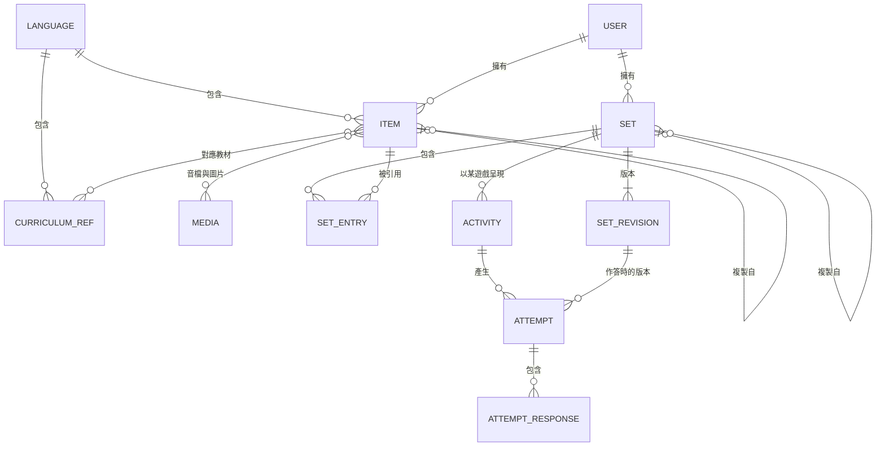

# Kancil Quiz 規格書

> **Kancil Quiz**（kancil 是印尼語、馬來語的「鼷鹿」，取其機伶頑皮之意）：給新住民語文老師的互動練習平台。以共備語料為核心，同一份語料可以切換成多種遊戲，是 Wordwall 的開源替代方案。

| 項目 | 內容 |
|---|---|
| 版本 | v0.1.18（草案） |
| 日期 | 2026-10-05 |
| 維護者 | 許家雋 |
| 狀態 | M1 完成，待教師試用。M2 的範圍都已實作：T-11（成績頁）、共備（T-12、T-13、T-17、C-01、C-03）、教材題組（T-18，repo 中有印尼語第 1 冊；其他冊在後台匯入）、`flash-cards`、`match-up`、T-15 匯出與 O-02 獨立播放器。M3 進行中：T-14、S-04、T-06 已實作，互動教材加入圖卡牆與轉盤；v2 遊戲等試用回饋再選。資料的保存期限與媒體的清除已由每天的排程執行（第 5 節）。S-06：首頁與教材不需登入，訪客可以直接玩教材的一課；A-04：後台的人氣統計；T-03：老師用 Google 帳號登入，取消邀請制（T-02），加上帳號刪除（T-19）、檢舉（S-07）與帳號停用、上傳上限（A-05） |
| 修訂 | v0.1.18：教材的課名與詞彙照原教材的版權頁標示：作者是國教署，授權是 CC BY-NC-ND 4.0；自製的插圖維持 CC BY 4.0。老師複製後，取自教材的詞條仍保留原本的標示，題組的授權只是老師自己加入的內容的預設（D-4、3.6）。教材試玩可以直接換遊戲；後台列出缺插圖的詞；老師可以在成績頁刪除一次作答（3.4、3.5、3.6、T-11、10.3）。播放頁以外的頁面不能被其他網站嵌入，加上 HSTS；暫用網域可以整站不讓搜尋引擎收錄（第 11 節）<br>v0.1.17：D-6 改為任何 Google 帳號都能登入，第一次登入就建立老師帳號（T-03 升為 M），取消邀請制註冊（T-02）；平台不管老師的密碼，不寄驗證信，密碼登入、雙重驗證與 passkey 只給管理員。老師可以刪除自己的帳號，做法是匿名化（T-19、第 5 節）。開放註冊後的防濫用：播放頁的檢舉（S-07）、管理員停用帳號與每位老師的上傳上限（A-05、第 9 節）。新增隱私權政策與使用條款頁；工作階段不再記錄 IP 與瀏覽器（第 2 節、4.1、4.2、4.4、第 5、9 節、10.1、10.3、第 11、13、14 節）<br>v0.1.16：新增 A-04 人氣統計：教材試玩在按下「開始」與玩完時各計一次，只累計每課、每個遊戲、每天的次數（`curriculum_plays`），不存逐筆紀錄與 IP、不用 cookie；同一個分頁只算第一次，重新整理與「再玩一次」不重複算。後台另外列出直接用教材題組建立的活動的作答數（3.4、4.4、第 5 節、10.3、第 11 節）<br>v0.1.15：試玩後的調整。字卡與圖卡牆不再顯示結果頁：最後一張（最後一頁）的按鈕改為「再玩一次」，結束這次作答後直接重新開始，遊戲以 `completed` 事件的 `replay` 通知宿主；要輸入名字的活動回到開始畫面，名字已經填好，也可以換人。`Face` 新增 `lang`（文字的語言），轉盤的扇形預設顯示目標語的文字。首頁與教材只列出已經匯入詞彙的語言（7.2、7.5、3.6、S-03）<br>v0.1.14：新增 S-06，首頁與教材不需登入：首頁對老師說明並列出教材的課表，訪客可以瀏覽每一課並直接試玩，不建立活動、不留作答紀錄；老師登入後在同一頁建立活動。公開頁面在伺服器端輸出骨架與 `<head>` 的標題、描述，給搜尋引擎與連結預覽（第 2 節、3.2、3.4、3.6、4.2、10.3、第 11 節、M3）<br>v0.1.13：資料的保存期限改由每天的排程 `kancil:prune` 執行，補上細節：題組版本被取代 30 天後才清除，有審核紀錄引用的版本與教材題組的版本保留；剛上傳、還沒儲存的媒體保留 7 天；老師刪除的題組、活動與移除的詞條 30 天後真正刪除，連同作答紀錄（3.3、第 5、9、11 節）<br>v0.1.12：遊戲分成計分的「遊戲」與不計分的「互動教材」，老師端與獨立播放器依此分組；字卡歸入互動教材，新增圖卡牆（`card-wall`）與轉盤（`spin-wheel`）。v2 候選加入開箱、賓果、跟讀，跟讀因為學生不見得有平板而延後（7.5、10.2、M3）<br>v0.1.11：A-03 改為在後台匯入教材：上傳一冊的詞彙資料檔（可以直接用整理教材時的「課文與詞彙.json」），以及依檔名批次上傳插圖，兩者都先預覽再寫入，可以先匯入詞彙、之後再補插圖。重新匯入詞彙時保留已有的插圖；「審核者修正過」改為看最近一次匯入詞彙之後有沒有別人的版本，上傳插圖不算修正（3.6）。冊課維持老師選填，公開前由審核者確認<br>v0.1.10：D-2 已決，程式碼採 AGPL-3.0-or-later。部署改用 Docker Compose（FrankenPHP），取代 Nginx＋PHP-FPM＋systemd（第 11 節、`docs/deploy.md`）。T-06 瀏覽器錄音：每個音檔欄位可以直接錄音，詞彙組另有逐詞錄音，錄音原樣上傳後轉檔（第 9 節）。活動不再分練習與作業兩種模式，改為兩個獨立、隨時可改的設定：學生要不要輸入名字或座號，以及開放與截止時間（預設今天起開放一週）。名字的格式、重玩與計分方式、截止的寬限、CSV 下載（3.4、7.4、10.3）；T-14、S-04 的文字隨之調整<br>v0.1.9：迷宮的遊戲 ID 由 `maze-chase` 改為 `maze-quiz`，名稱由「迷宮追逐」改為「迷宮問答」，避免與 Wordwall 的模板同名；既有活動以 migration 改名（7.5）。迷宮拆成獨立的 `maze-quiz` repo（MIT），以 git submodule 引用；M4 加入把 SDK 套件發布到 npm（10.2、11、M4）<br>v0.1.8：加入字卡與配對（7.5）；T-15 匯出 zip，老師端另有下載路由，公開題組的 API 不需登入（10.3）；O-02 獨立播放器是單一個 HTML 檔，打開匯出的 zip 遊玩（10.2）。`answered` 事件新增選填的 `presented`：配對分頁顯示，同一頁出現哪些卡片只有遊戲知道，所以由遊戲提供（7.2、7.4）<br>v0.1.7：修訂 D-4，改為收錄國教署教材的課名與詞彙，不收錄課文、教材插圖與音檔；每一課匯入成教材題組，老師依語言、冊、課瀏覽，直接建立活動或挑詞建立題組（3.2、3.6、T-18、A-03、第 5 節、10.3）<br>v0.1.6：共備的實作決定。D-12 已決（維持 public disk）；題組層級加上冊課與標籤（3.6、第 5 節）；分享連結改用另外產生的 token（3.2）；公開後修改直接生效（3.2）；C-03 的修訂紀錄沿用題組版本，不另裝 activitylog（第 5 節、10.1）；審核者不能審核自己的題組（第 2 節）<br>v0.1.5：新增建立活動前的預覽路由（10.3）；T-11 成績頁先於 M2 其他項目完成；M3 範圍刪除重複的「逐題答錯率」（已含在 T-11）<br>v0.1.4：M1 實作中的調整。ULID 用大寫且每次重新取隨機值（第 5 節）；PHP 測試改用 PHPUnit；媒體在上傳請求中同步轉檔（第 9 節）；新增 D-13（介面字串 i18n）、D-14（迷宮字型大小）<br>v0.1.3：專案定名為 Kancil Quiz（D-1）；語料全部自製，不匯入國教署教材（D-4）；教師社群調查擱置，M0 不再等待調查結果<br>v0.1.2：整合審閱意見。新增題組版本（3.3）、題組可見性定義與分享連結（T-17）、遊戲相容規則（7.3）與伺服器判分（7.4）、活動播放格式（6.6）；複製題組改為複製詞條；授權改記在詞條與媒體上；M1 縮為兩個遊戲<br>v0.1.1：第一階段語言範圍限定為印尼語與越南語，其餘語言分兩階段擴充（見 1.4） |

---

## 1. 背景與目標

### 1.1 背景

- 國小新住民語文教學支援人員的教師社群，在培訓中學習用 Wordwall 製作互動練習，但 Wordwall 費用高，使用上也有不便。
- 評估過 H5P 後決定不採用為平台。H5P 適合測驗型練習，但缺少街機型遊戲，無法讓同一份內容切換多種模板；Drupal 整合模組目前無人維護；OER Hub 上幾乎沒有給這群受眾的內容。H5P 只保留為日後的匯出格式選項。
- 已經有一個自製的迷宮遊戲 maze-quiz（TypeScript），試玩評價良好，會作為第一個遊戲模組。

### 1.2 目標

1. **語料優先**：詞條與題組是核心資產，遊戲只是讀取語料的呈現方式。
2. **一份語料、多種遊戲**：同一個題組可以一鍵切換成不同遊戲，對應 Wordwall 的「切換模板」。
3. **共備**：老師可以分享、複製、改編彼此的題組。
4. **可攜**：語料有公開的交換格式，可以完整匯出；遊戲能脫離後端獨立執行。
5. **低維運**：一個人就能維護，單台主機即可運作。
6. **開源**：程式碼與語料都以開放授權釋出。

### 1.3 非目標（v1 不做）

- 學生帳號與登入
- LTI、完整的 LRS
- 即時多人對戰
- 原生 App（網頁支援平板即可）
- 與 H5P 平台整合（.h5p 匯出器列為後期選項）
- 網站頁面編輯（這不是網站 CMS）

### 1.4 語言支援範圍

語言分階段開放。架構一開始就以七種語言為前提設計，但測試與內容只要求已開放的語言。

| 階段 | 語言 | 理由 |
|---|---|---|
| 第一階段（M0 到 M4） | 印尼語 `id`、越南語 `vi` | 優先支援的教學語言 |
| 語言擴充一（M5） | 馬來語 `ms`、菲律賓語 `fil` | 同為拉丁字母，新增成本低；馬來語與印尼語相近 |
| 語言擴充二（M6） | 泰語 `th`、柬埔寨語 `km`、緬甸語 `my` | 複雜文字，需要字型、斷詞、編碼等額外工作（見第 8 節） |

擴充的順序是建議，可依教師社群的需求調整（見 D-10）。

第一階段的原則：

- 未開放的語言不出現在老師端的選單中（由 `languages.enabled` 控制）。
- 程式仍須遵守第 8 節的文字處理規則，例如一律用 `graphemes()` 切字。這樣之後開放複雜文字時，不必改寫遊戲。
- 本文件中標示「（M6）」的項目，第一階段不實作。

---

## 2. 使用者與角色

| 角色 | 說明 | 主要權限 |
|---|---|---|
| 學生（訪客） | 國小學生，透過連結或 QR code 遊玩；也包括還沒註冊、先來看看的老師 | 遊玩活動、送出作答，瀏覽教材並直接試玩一課（S-06），不需帳號 |
| 老師 `teacher` | 新住民語文教學支援人員。任何 Google 帳號都能登入，第一次登入就建立帳號（T-03） | 建立與編輯自己的詞條、題組、活動；檢視自己活動的成績；複製別人公開或分享的題組；刪除自己的帳號（T-19） |
| 審核者 `curator` | 各語言的資深老師 | 審核題組公開申請、標記重複詞條、修正公開語料 |
| 管理員 `admin` | 平台維護者 | 帳號、語言、教材對照表等設定；匯入教材（A-03）；處理檢舉、停用帳號（A-05）。另外可以用密碼登入 |

角色以 `spatie/laravel-permission` 實作。第一次用 Google 登入的人是老師；審核者與管理員由管理員在後台指定（第一位管理員用 `kancil:create-admin` 建立）。審核者的權限限定在管理員指定的語言（`language_user`），只能審核與修正這些語言的題組；審核者不能審核自己的題組，管理員可以。

---

## 3. 核心概念



### 3.1 詞條（Item）

語料的最小單位：一個詞或短句在某種語言中的表示。

| 欄位 | 說明 |
|---|---|
| `text` | 目標語文字，以 NFC 正規化後儲存 |
| `romanization` | 羅馬拼寫，選填（泰、緬、柬語建議填寫） |
| `translation_zh` | 中文意思 |
| `audio` | 發音音檔，選填，可以有多個（例如不同發音者），最多 3 個，遊戲播放第一個。每個檔案各自記錄作者、出處、授權。編輯頁列出每一個，可以各自播放與移除，「再加一個」不會蓋掉原本的 |
| `image` | 圖片，選填。同樣各自記錄作者、出處、授權 |
| `language` | 語言代碼（見附錄 A） |
| `curriculum_refs` | 對應教材的冊與課，多對多；匯入詞彙的課另有教材題組（3.6） |
| `tags` | 標籤 |
| `owner` | 擁有者，只有擁有者（與審核者）能修改 |
| `license`、`authors`、`source` | 授權、作者（署名用，可以有多位）、出處 |

詞條屬於建立它的老師，題組只引用擁有者自己的詞條。複製別人的題組時，詞條也一併複製，之後原作者修改原詞條，不會影響複製出去的題組（見第 5 節）。

### 3.2 題組（Set）

老師出題的單位，對應 Wordwall 的一份活動內容。v1 支援兩種題組：

- **`vocab`（詞彙組）**：有序的詞條清單。由 `faces` 設定決定哪一面當題目、哪一面當答案，例如「看中文選越南文」「聽音檔選圖片」。
- **`quiz`（問答組）**：有序的問題清單，每題有題幹與 2 到 6 個選項，v1 每題恰有一個正解（多個正解見 D-11）。選項可以是文字或圖片，題幹可以附圖片或音檔。

v2 預計加入 `group`（分類）與 `sentence`（重組句子）。

題組的可見性：

| 可見性 | 誰能檢視與複製 | 誰能匯出 | 列在共備庫 |
|---|---|---|---|
| `private` | 擁有者 | 擁有者 | 否 |
| `unlisted` | 拿到題組連結的老師（需登入） | 同左 | 否 |
| `public` | 所有老師（需登入） | 任何人，不需登入（開放資料） | 是 |

題組要經審核者通過（`review_status` 為 `approved`）才能設為 `public`。審核者可以檢視自己負責語言中待審的題組。

老師端不提供三選一的可見性選單。題組預設為 `private`；題組頁有「產生分享連結給同事」按鈕（T-17），按下後改為 `unlisted`，收回時改回 `private`。收回只會擋住之後的存取，已經被複製出去的題組不受影響。公開則走申請與審核（T-12）。

分享連結是 `/shared/{token}`，token 另外隨機產生，不使用題組 ID：題組 ID 會出現在學生端的活動播放格式中（6.6），而且收回後再產生的應該是新的連結。題組公開後就不需要分享連結，通過審核時一併收回。

已公開的題組，擁有者修改後直接生效，不需重新審核。每次修改都會留下版本（3.3），審核者看得到是誰改了什麼，必要時可以修正內容或附上原因下架（C-03）。

`unlisted` 與活動連結的差別在對象：活動連結給學生遊玩，題組的分享連結給老師複製改編。

**教材題組**（3.6）是例外：由教材帳號擁有、直接公開，不經審核。任何人不登入就能瀏覽並直接試玩（S-06）；所有老師都能直接用教材題組建立活動，不必先複製；活動頁只列出自己建立的活動，因為活動連結本身就是存取憑證（3.4）。教材題組沒有人能分享、申請公開、下架或刪除（刪除題組會一併刪除活動，其中有其他老師的活動）；負責該語言的審核者可以修正內容，修改記在修訂紀錄中，用它建立的活動立即生效。

### 3.3 題組版本（SetRevision）

題組的內容每次變動，系統就自動產生一個不可變的版本，讓作答紀錄永遠能對照到學生當時看到的題目。

- 題組本身或其中任何詞條修改並儲存後，系統以題組當下的內容產生新版本。版本的內容就是匯出用的 `set.json`（見第 6 節）；內容與上一版相同時不產生新版本。
- 老師端沒有「發布」步驟。活動一律使用題組的最新版本，所以老師修正錯字後，已發出的連結與 QR code 立即生效。
- 每筆作答記下它使用的版本，成績與答錯的題目都依該版本解讀，不受之後的修改影響。結果頁涵蓋多個版本時要標示出來。
- 版本引用的媒體檔不可修改：替換音檔或圖片時會產生新的媒體，舊的等到沒有任何版本引用時才清除（見第 5 節）。
- 舊版本沒有作答或審核紀錄引用時，被取代 30 天後清除（見第 5 節）。修訂紀錄因此看得到最近 30 天的每次修改，更早的只剩有作答或審核紀錄的版本，與前一個留下的版本比較。

### 3.4 活動（Activity）

「題組＋遊戲＋遊戲設定」的組合，是分享的單位，有自己的網址與 QR code。同一個題組可以建立多個活動，這就是「切換模板」。活動指向題組而不是特定版本，播放時一律使用最新版本（見 3.3）。

活動的遊玩連結與題組的可見性無關：持有連結的人都能遊玩，題組是 `private` 也一樣。活動連結本身就是存取憑證。

教材的一課不必經過活動就能試玩（S-06）：用遊戲的預設設定，以教材題組的最新版本播放，不建立活動，也不留作答紀錄，成績只顯示在玩的人自己的畫面上。開始與結果畫面列出這一課能玩的其他遊戲，可以直接換。要發給學生、看成績，仍然要建立活動。

試玩只累計次數，給人氣統計（A-04）：播放器在按下「開始」與玩完（包括遊戲中的「再玩一次」）時各送一次，只帶遊戲與事件，伺服器依台灣時間的日期累加到這一課、這個遊戲當天的次數。同一個分頁、同一課的同一個遊戲只算第一次開始與第一次玩完（記在 `sessionStorage`），重新整理、結果頁或遊戲中的「再玩一次」都不重複算，所以玩完的次數不會多於開始的次數。

活動有兩個設定，彼此獨立，建立後隨時都能修改（T-14）：

- **學生要先輸入名字或座號**：預設關閉，學生開了就玩，不記名。開啟時學生要先輸入，老師在結果頁看到每位學生的成績，也可以下載成 CSV。
  - 一個自由輸入的欄位，最多 20 個字。新住民語文課常是跨班的小組，座號會重複，所以不限定只收座號。
  - 存入前統一格式：全形英數字轉半形（NFKC）、合併連續空白、去掉頭尾空白，只有數字時去掉前導的 0（「０５」「05」都存成「5」）。結果頁依名字分組時不分大小寫。
  - 學生可以重玩，成績以第一次玩完的那次為準（7.4）。
  - 名字只存在播放頁的記憶體中，不存進瀏覽器：教室的平板常是多位學生輪流用。「再玩一次」沿用同一個名字，另有「換人」。
  - 開始作答失敗時不讓學生玩，顯示「沒有連上伺服器」與「再試一次」：否則學生會以為交了作業，其實沒有紀錄。不記名的活動則照舊讓學生在本機玩。
- **開放時間與截止時間**：都可以不填。不填開放時間就是立刻開放，不填截止時間就是一直有效。建立活動時預設為今天 00:00 開放、第 7 天 23:59 截止（共一週），老師可以修改或清空。
  - 老師端以台灣時間（`kancil.timezone`）輸入與顯示，資料庫與 API 用 UTC。
  - 開放前與截止後不能開始新的作答，伺服器分別回「還沒開放」「已經截止」。截止前開始的作答，截止後仍可以送完。
  - 活動頁有「立即截止」；截止後把截止時間延後，就重新開放。
  - 「換成其他遊戲」（T-10）沿用原活動的設定；原活動已截止時，時間改用預設值。

「要輸入名字」在資料中沿用 `activities.mode`：`assignment` 表示要輸入，`practice` 表示不必（第 5 節、6.6）。老師端的畫面上沒有「模式」這個詞。

### 3.5 作答（Attempt）

學生玩一次活動會產生一筆 Attempt，內含逐題的作答紀錄。欄位設計對應 xAPI statement 的結構，方便日後匯出，但 v1 不接 LRS。正式成績由伺服器依作答時的題組版本判定，不採信玩家端回報的分數（見 7.4）。

老師可以在成績頁刪除一次作答，例如自己用正式連結試玩留下的（T-11）。直接刪除，逐題的作答一起刪除，成績、學生與答錯率隨之重算。

### 3.6 教材對照與教材題組（CurriculumRef）

對應國教署新住民語文數位學習教材（[新住民子女教育資訊網](https://mkm.k12ea.gov.tw/textbook)）的「語言／冊／課」，讓老師依課次引用教材的詞彙、找題組。

- **收錄範圍**：教材紙本採 CC BY-NC-ND 4.0。平台只收錄各課的課名與詞彙（詞與中文意思），不收錄課文、教材的插圖與音檔；插圖與發音一律自製（D-4）。
- **教材資料**：管理員在後台的「匯入教材」頁匯入（A-03），詞彙與插圖分開上傳，可以先匯入詞彙、之後再補插圖：
  - **詞彙**：選語言與冊，上傳一冊的 JSON。可以直接用整理教材時的「課文與詞彙.json」（課文不讀），也可以用 repo 的 `volume.json`。資料檔的書名或語言、冊與選擇的不同時擋下。寫入前先預覽每一課是新增、更新、沒有變動或略過。
  - **插圖**：選語言與冊，一次上傳多張圖，依檔名對應到這一冊的詞：檔名轉小寫，空白與符號都當成 `_`（`ibu_guru.png` 對應 `ibu guru`）。找不到完全相同的，才忽略聲調等附加符號比對，而且只在剛好一個詞符合時採用。同一冊中好幾課都有的詞用同一張圖；不跨冊沿用，因為同一個詞在不同冊的意思可能不同（例：第 1 冊的 kakek 是爺爺，第 2 冊是外公）。選了冊就先列出這一冊還沒有插圖的詞與對應的檔名；寫入前列出配對結果，配不到或有好幾個詞符合的圖可以手動選詞，也列出上傳後仍沒有插圖的詞。後台的「教材對照」表也列出每一課缺插圖的詞，可以只看缺插圖的課。已經有圖的詞預設不動，勾選後才取代。署名在上傳時填寫，預設 Kancil Quiz、CC BY 4.0、AI 生成。
  - repo 的 `database/curriculum/<語言>/<冊>/`（`volume.json` 加插圖，格式見該目錄的 README）放示範資料與 E2E 用的印尼語第 1 冊，也可以用 `php artisan kancil:import-curriculum <目錄>` 匯入。其他冊在後台匯入，不放進 repo。
- **教材題組**：匯入時每一課產生一個詞彙組，題目是「看圖片與中文意思，選目標語」。由不能登入的教材帳號擁有，直接公開，權限見 3.2。題組與詞條（課名與詞彙）照原教材的版權頁標示：作者是國教署（總編輯），授權是 CC BY-NC-ND 4.0，不另列擁有它的教材帳號；詞條的出處記下教材名稱、課次與課本頁碼。插圖是自製的，各自記錄作者、出處與授權（Kancil Quiz、AI 生成、CC BY 4.0）。課頁寫出這兩種署名，並連到授權條款。
- **複製後的授權**：複製教材題組或挑詞時，取自教材的詞條保留原本的作者、授權與出處，匯出的 `LICENSE.txt` 列出它們。題組的授權是老師之後自己加入的內容的預設，老師只能選 D-3 的授權，所以複製教材題組時改用預設的 CC BY 4.0。老師修改取自教材的詞條時，和其他複製來的詞條一樣把老師加進作者（第 5 節），出處不變。
- **重新匯入**：可以重複執行。詞以目標語文字對應，題目 ID 不變，作答紀錄仍對得上；內容沒變時不產生新版本。資料檔沒有插圖的詞保留原本的插圖與錄音。審核者在網站上修正過的課會略過，以免蓋掉修正：把修正寫回資料檔後再強制匯入。是否修正過，看最近一次匯入詞彙之後有沒有教材帳號以外的版本（`curriculum_refs.imported_revision`）；在後台上傳插圖的版本記在教材帳號名下，不算修正，也不會清掉修正過的標記。
- **訪客（S-06）**：首頁與「教材」不需登入，依語言、冊、課瀏覽每一課的詞彙與插圖，並直接試玩（3.4）。只列出已經匯入詞彙的語言。只列出這一課能玩的遊戲（7.3）。看不到老師的功能與共備庫的內容，只看得到「登入後可以建立活動」的說明與共備庫中對應這一課的題組數。有課名、還沒匯入詞彙的課說明還沒有詞彙，不能玩。
- **老師端（T-18）**：側邊欄「教材」依語言、冊、課瀏覽，與訪客是同一頁，另外有老師的功能。每一課可以直接選遊戲建立活動、複製成自己的題組，或從一課或多課挑詞建立詞彙組。挑詞時詞條以複製的方式加入（第 5 節），題組自動對應這些課；只來自一課時，複製來源是該課的教材題組。
- 題組與詞條都可以對應冊課：共備庫依題組的冊課搜尋（T-13），問答組沒有詞條，也能標記；詞條的對應保留給日後合併重複詞條（C-02）使用。
- 題組的冊課由老師選填，複製教材題組與挑詞時自動帶入。私人題組的冊課只影響老師自己；申請公開時由審核者確認冊課是否正確（C-01），公開後標錯也可以修正（C-03）。

---

## 4. 功能需求

優先順序：**M** = MVP 必備，**S** = 應該要有，**C** = 有餘力再做。

### 4.1 老師

| ID | 需求 | 優先 |
|---|---|---|
| T-01 | 管理員以 email 與密碼登入（Fortify），可以啟用雙重驗證與 passkey。Google 出問題時仍能進後台 | M |
| T-02 | ~~邀請制註冊~~：v0.1.17 取消，老師改用 Google 登入（T-03） | — |
| T-03 | 以 Google 帳號登入（Socialite，只用 openid、email、profile）。任何 Google 帳號都能登入，第一次登入就建立老師帳號，不必另外註冊；平台不管老師的密碼，也不寄驗證信。依序對應：同一個 Google 帳號 → 同一個 email（Google 已驗證）而且還沒連結 Google 的既有帳號 → 建立新帳號。email 沒有驗證的 Google 帳號不能登入。開了雙重驗證的帳號仍要輸入驗證碼 | M |
| T-04 | 建立詞彙組：逐列輸入，或一次貼上多行「目標語`<Tab>`中文」文字 | M |
| T-05 | 為詞條上傳音檔與圖片 | M |
| T-06 | 在瀏覽器中直接錄音（MediaRecorder） | S |
| T-07 | 建立問答組：題幹加 2 到 6 個選項，標示一個正解 | M |
| T-08 | 為題組選擇遊戲、調整設定、預覽。只能選與題組相容的遊戲；不相容的遊戲要說明是哪幾題、缺少什麼（見 7.3） | M |
| T-09 | 產生分享連結與 QR code；提供投影模式（大字、全螢幕） | M |
| T-10 | 同一題組一鍵換成其他遊戲（建立新活動） | M |
| T-11 | 檢視自己活動的作答紀錄與逐題答錯率；刪除一次作答（3.5） | S |
| T-12 | 申請將題組公開到共備庫 | S |
| T-13 | 依語言、冊、課、標籤瀏覽與搜尋共備庫，複製後改編 | S |
| T-14 | 活動可以要求學生先輸入名字或座號，並設定開放與截止時間（見 3.4） | S |
| T-15 | 將題組匯出為交換格式的 zip | S |
| T-16 | 匯入 zip 或 CSV | C |
| T-17 | 產生題組的分享連結給同事，讓對方不必經過審核就能檢視與複製；可以隨時收回（見 3.2） | S |
| T-18 | 依語言、冊、課瀏覽教材的詞彙；直接用教材題組建立活動，或挑詞建立自己的詞彙組（見 3.6） | S |
| T-19 | 在設定頁刪除自己的帳號，輸入自己的 email 確認；做法是匿名化（見第 5 節）。管理員不能刪除自己的帳號 | S |

### 4.2 學生

| ID | 需求 | 優先 |
|---|---|---|
| S-01 | 開啟連結即可遊玩，不需帳號 | M |
| S-02 | 平板直向、橫向都能玩，支援觸控 | M |
| S-03 | 結束時顯示結果：計分的遊戲顯示答對題數，並列出答錯的題目（可播放發音）；轉盤顯示看過的張數。字卡與圖卡牆沒有結果頁，最後一張可以直接再玩一次（7.2） | M |
| S-04 | 老師要求時，先輸入名字或座號再開始（見 3.4） | S |
| S-05 | 網路短暫中斷時可以繼續玩，恢復連線後補送作答 | C |
| S-06 | 不登入就能依語言、冊、課瀏覽教材，直接試玩一課，不留作答紀錄（見 3.4、3.6）。專案剛起步，老師不見得願意先註冊，先讓老師看到、玩到自己教的那一課 | S |
| S-07 | 活動的開始與結果畫面有「檢舉這個活動」：寫下原因送給網站管理員，只存活動與原因，不記錄是誰檢舉。預覽、教材試玩與獨立播放器沒有 | S |

### 4.3 審核者

| ID | 需求 | 優先 |
|---|---|---|
| C-01 | 審核公開申請：通過，或附意見退回 | S |
| C-02 | 把重複的公開詞條標為同一組，在共備庫中合併顯示，保留各自的音檔與出處。不刪除或改寫任何人的詞條 | C |
| C-03 | 編輯公開語料，並保留修訂紀錄 | S |

### 4.4 管理員

| ID | 需求 | 優先 |
|---|---|---|
| A-01 | Filament 後台：管理使用者、角色、語言、教材對照表 | M |
| A-02 | 檢視系統狀態：儲存空間（磁碟剩餘空間、上傳的媒體與資料庫的大小）、最近一次備份與 `kancil:prune` 的結果（時間、大小或刪除的筆數、失敗的原因），以及排程是否還在運作。備份或清除失敗、超過一天沒有執行，或排程超過 1 小時沒有回報時顯示警告。目前沒有佇列任務，不列。只有管理員能看 | S |
| A-03 | 在後台匯入一冊教材的課名與詞彙，每一課產生教材題組；依檔名批次上傳插圖（見 3.6） | S |
| A-04 | 人氣統計：每課、每個遊戲的試玩次數（開始、玩完、玩完比例，見 3.4）與課堂的作答數，可依期間（最近 7 天、30 天、全部）與語言篩選。課堂只算直接用教材題組建立的活動，每一次作答（包括再玩一次）都算，只到作答紀錄的保存期限；複製或挑詞做成的題組不算在這一課。只有次數，管理員與審核者都能看 | S |
| A-05 | 防濫用（任何 Google 帳號都能註冊之後）：處理檢舉（列表、標為已處理、直接停用老師）；停用帳號：不能登入，已經登入的被登出，活動連結、分享連結與開放資料都失效，公開的題組不再列在共備庫，資料保留、可以恢復；代老師刪除帳號（匿名化）；每位老師上傳的媒體總量上限，可以為個別老師調整（第 9 節） | S |

### 4.5 開放資料

| ID | 需求 | 優先 |
|---|---|---|
| O-01 | 每晚將公開語料匯出為交換格式，推送到公開的 Git repo | C |
| O-02 | 獨立播放器：只用靜態檔案就能播放匯出的題組 | S |
| O-03 | .h5p 匯出器（`vocab` 轉 Dialog Cards，`quiz` 轉 Question Set） | C |

---

## 5. 資料模型

公開識別碼一律用 ULID（網址、匯出檔中不暴露遞增 ID），採標準的大寫形式。隨機部分每次都重新取 80 位元：同一毫秒內不可只把隨機部分加一，否則相鄰建立的活動連結可以互相推算（活動連結本身就是存取憑證，見 3.4）。以下只列主要欄位。

| 資料表 | 主要欄位 | 說明 |
|---|---|---|
| `users` | `id`、`name`、`email`、`password`（可以是空的）、`google_id`、`disabled_at`、`anonymized_at`、`upload_quota_mb`、`locale` | 用 Google 登入的老師沒有密碼（T-03）。`disabled_at` 是管理員停用的時間（A-05），`anonymized_at` 是刪除帳號的時間（T-19）。`upload_quota_mb` 是管理員為個別老師調整的上傳上限，空的就用預設值（第 9 節） |
| `reports` | `id`、`activity_id`、`reason`、`created_at`、`resolved_at`、`resolved_by` | 播放頁的檢舉（S-07）。不存 IP 或檢舉人的資料；活動真正刪除時一起刪除 |
| `languages` | `code`（PK）、`name_zh`、`name_native`、`script`、`word_spacing`（bool）、`enabled`（bool） | 預建 7 種語言，第一階段只開放 `id`、`vi`；見附錄 A |
| `curriculum_refs` | `id`、`language_code`、`volume`、`lesson`、`title_zh`、`title_native`、`set_id`、`imported_revision` | 教材冊課對照。`title_native` 是目標語的課名，`set_id` 是這一課的教材題組，`imported_revision` 是最近一次匯入詞彙後教材題組的版本號（3.6） |
| `curriculum_plays` | `id`、`curriculum_ref_id`、`game_id`、`date`、`starts`、`finishes` | 教材試玩的人氣統計（A-04）：一課、一個遊戲、一天（台灣時間）一列，`(curriculum_ref_id, game_id, date)` 唯一，每次計次加 1。只有次數，沒有個資，不清除 |
| `media` | `id`（ULID）、`kind`（`audio`／`image`）、`path`、`mime`、`bytes`、`duration_ms`、`width`、`height`、`authors`（json）、`license`、`source`、`uploaded_by` | 轉檔完成後的檔案。檔案內容不可變，署名資料可以修正 |
| `items` | `id`（ULID）、`language_code`、`text`、`romanization`、`translation_zh`、`tags`（json）、`owner_id`、`authors`（json）、`license`、`source`、`forked_from_id` | soft delete |
| `item_media` | `item_id`、`media_id`、`role`（`audio`／`image`）、`position` | 詞條的音檔與圖片 |
| `item_curriculum_ref` | `item_id`、`curriculum_ref_id` | 樞紐表 |
| `sets` | `id`（ULID）、`kind`（`vocab`／`quiz`）、`title`、`description`、`language_code`、`owner_id`、`visibility`（`private`／`unlisted`／`public`）、`review_status`（`none`／`pending`／`approved`／`rejected`）、`faces`（json）、`forked_from_id`、`license`、`current_revision_id`、`tags`（json）、`authors`（json，複製來源的作者）、`share_token` | soft delete。交換格式的 `authors` 是複製來源的作者，最後加上目前的擁有者 |
| `set_curriculum_ref` | `set_id`、`curriculum_ref_id` | 題組對應的冊課（3.6） |
| `set_reviews` | `id`、`set_id`、`set_revision_id`、`user_id`、`action`（`requested`／`withdrawn`／`approved`／`rejected`／`unpublished`）、`note`、`created_at` | 公開申請與審核的紀錄，只新增不修改（T-12、C-01） |
| `language_user` | `user_id`、`language_code` | 審核者負責的語言（第 2 節） |
| `set_entries` | `id`（ULID）、`set_id`、`position`、`item_id`（vocab 用）、`payload`（json，quiz 用） | quiz 題幹與選項的媒體以 `media` 的 ID 寫在 `payload` 中 |
| `set_revisions` | `id`（ULID）、`set_id`、`number`、`content`（json，交換格式）、`content_hash`、`created_by`、`created_at` | 不可變，見 3.3 |
| `activities` | `id`（ULID）、`set_id`、`game_id`、`game_version`、`options`（json）、`mode`（`practice`／`assignment`）、`opens_at`、`closes_at`、`owner_id` | 播放時使用題組的 `current_revision_id`。`mode` 為 `assignment` 表示學生要先輸入名字或座號（3.4） |
| `attempts` | `id`（ULID）、`activity_id`、`set_revision_id`、`seed`、`player_label`、`token_hash`、`started_at`、`completed_at`、`correct_count`、`round_count`、`game_score`、`duration_ms` | `correct_count`、`round_count` 由伺服器計算，不計分的遊戲 `correct_count` 為 null；`game_score` 由遊戲回報，只供顯示（見 7.4）。不存 IP |
| `attempt_responses` | `id`、`attempt_id`、`entry_id`、`presented`（json）、`selected`（json）、`correct`、`client_correct`、`duration_ms`、`created_at` | `entry_id` 對應版本內容中的 entry，不設外鍵；`correct` 由伺服器判定。不計分的遊戲只記錄看過哪些題，`selected`、`correct` 為 null |

規則：

- 所有文字欄位寫入前以 NFC 正規化（見第 8 節）。
- 題組被複製時，詞條也一併複製：新題組的 `forked_from_id` 指向原題組，新詞條的 `forked_from_id` 指向原詞條，`authors` 沿用原作者；新的擁有者修改複製來的詞條時，把他加進 `authors`。之後原作者或審核者修改原詞條，不影響複製出去的題組。
- 複製的詞條與原詞條引用同一批 `media`，不複製媒體檔（媒體檔不可變，共用是安全的）。
- 老師修改複製來的詞條時，把自己加進該詞條的 `authors`。
- 詞條沒有自己的可見性，由引用它的題組決定。
- 語料的修訂紀錄（C-03）沿用題組版本：`set_revisions.created_by` 記錄是誰修改的，題組檢視頁比較相鄰的版本，列出修改了什麼。不另外使用 activitylog。
- **刪除帳號是匿名化**（T-19）：題組、媒體、版本與審核紀錄都指向使用者，共備庫中可能有別人在用，所以不真的刪除使用者。名字改成「已刪除的使用者」，清掉 email、Google ID、密碼、雙重驗證、passkey、角色與工作階段，之後不能再登入；自己的活動與沒有公開的題組（私人、用分享連結的）先 soft delete，30 天後由 `kancil:prune` 連同作答一起刪除。已經公開到共備庫的題組留下，署名照舊：刪除時把名字寫進題組的 `authors`，之後不再加上目前擁有者的名字。
- 教材題組由教材帳號（`textbook@kancil-quiz.invalid`）擁有：沒有密碼、沒有驗證 email、沒有角色，不能登入（3.6）。
- 保存期限由每天的排程 `kancil:prune` 執行（台灣時間凌晨 4 點，在備份之後），期限在 `config/kancil.php` 的 `retention`；`--dry-run` 只列出會刪除的筆數。每次真正執行的結果（時間、各項刪除的筆數，或失敗的原因）記在 volume 的 `storage/app/private/status/prune.json`，後台的系統狀態頁顯示最近一次（A-02）：
  - 媒體在沒有任何詞條、問答題或題組版本引用時清除。剛上傳的媒體老師可能還沒儲存，上傳 7 天後才清除；媒體目錄中沒有對應資料的檔案也一樣。
  - 作答紀錄預設保存 12 個月，從開始作答起算（`KANCIL_ATTEMPT_RETENTION_MONTHS`）。
  - 題組版本不是最新版本、沒有作答或審核紀錄（`set_reviews`）引用，而且被新版本取代超過 30 天時清除。教材題組的版本不清除：判斷審核者修正過要看匯入之後的版本（3.6）。
  - 老師刪除的題組、活動，以及從題組移除的詞條，先以 soft delete 保留 30 天（網站上沒有復原的功能，留給管理員處理誤刪），之後真正刪除，連同活動的作答紀錄、題組的內容、版本與只有它用到的詞條。複製出去的題組不受影響。

---

## 6. 語料交換格式（Kancil Set Format v1）

交換格式是整個專案的「公共契約」：匯出、匯入、題組版本、獨立播放器、公開資料集都用同一份格式。

專案中有三份契約，用途不同：

| 契約 | 定義位置 | 用途 |
|---|---|---|
| 題組交換格式（本節） | `set.v1.schema.json` | 可攜的題組內容：匯出檔、題組版本、公開資料集 |
| 活動播放格式（6.6） | `activity.v1.schema.json` | 播放 API 的回應：活動設定加上題組內容 |
| `Round`（7.2） | `@kancil-quiz/games-sdk` 的 TS 型別 | 宿主轉換後交給遊戲的題目，只存在於瀏覽器記憶體中，不在網路上傳輸，不另訂 JSON Schema |

### 6.1 規格來源

- JSON Schema 放在 `packages/schema/`（`set.v1.schema.json`、`activity.v1.schema.json`），是**唯一的規格來源**。
- TypeScript 型別由 `json-schema-to-typescript` 自動產生，不手寫。
- Laravel 以 `opis/json-schema` 驗證匯入檔與 API 輸出。
- CI 必須檢查：schema 變更時，產生的型別與測試用 fixture 同步更新。
- 用同一批 fixture 測兩條路徑：「匯出 → 匯入 → 再匯出」結果相同；「題組 → `Round[]`」的轉換結果與預期一致。

### 6.2 zip 結構

```
set-01M3ZYQZ9RJK6VGH2N6XVR9QTH.zip
├── set.json
├── media/
│   ├── 01M3ZYR188M6EWJQJWHW2KP6YE.m4a
│   └── 01M3ZYR27GF5QQW62SVZ5NA266.webp
└── LICENSE.txt
```

媒體檔以媒體的 ID 命名。`LICENSE.txt` 列出題組的授權，以及所有授權或作者與題組不同的詞條與媒體的署名。

### 6.3 詞彙組範例

```json
{
  "format": "kancil-set",
  "version": 1,
  "id": "01M3ZYQZ9RJK6VGH2N6XVR9QTH",
  "kind": "vocab",
  "language": "vi",
  "title": "第 3 冊第 2 課：水果",
  "license": "CC-BY-4.0",
  "authors": [{ "name": "王老師" }],
  "curriculum": [{ "volume": 3, "lesson": 2 }],
  "faces": {
    "prompt": ["translation_zh", "image"],
    "answer": ["text"]
  },
  "entries": [
    {
      "id": "01M3ZYR090HSK1QGN8BZGK07M3",
      "item": {
        "text": "quả chuối",
        "romanization": null,
        "translation_zh": "香蕉",
        "audio": [
          { "src": "media/01M3ZYR188M6EWJQJWHW2KP6YE.m4a" }
        ],
        "image": {
          "src": "media/01M3ZYR27GF5QQW62SVZ5NA266.webp",
          "authors": [{ "name": "李老師" }],
          "license": "CC-BY-4.0",
          "source": "自行拍攝"
        }
      }
    }
  ]
}
```

### 6.4 問答組範例

```json
{
  "format": "kancil-set",
  "version": 1,
  "id": "01M3ZYR36RHMWPTEYDYQQN7526",
  "kind": "quiz",
  "language": "vi",
  "title": "打招呼",
  "license": "CC-BY-4.0",
  "authors": [{ "name": "王老師" }],
  "entries": [
    {
      "id": "01M3ZYR460BP4AAE9S6E26T3VJ",
      "question": {
        "stem": { "text": "「謝謝」的越南語是？", "audio": null, "image": null },
        "options": [
          { "id": "a", "text": "cảm ơn", "correct": true },
          { "id": "b", "text": "xin chào", "correct": false },
          { "id": "c", "text": "tạm biệt", "correct": false }
        ]
      }
    }
  ]
}
```

### 6.5 格式規則

- 所有文字一律為 NFC。
- 媒體一律以物件表示（`{ "src": ... }`），不用純字串，以便附上署名資料。`src` 為 zip 內的相對路徑；API 輸出時由伺服器改寫為絕對網址。
- 詞條與媒體的 `authors`、`license`、`source` 為選填，省略時沿用外層（媒體沿用詞條，詞條沿用題組）。6.3 範例中的音檔沿用題組的作者與授權，圖片則另有作者與出處。
- `quiz` 的每一題恰有一個選項為 `"correct": true`（多個正解見 D-11）。
- `faces` 可用的欄位：`text`、`romanization`、`translation_zh`、`audio`、`image`。
- 新增**選填**欄位不升版；任何會讓舊檔案失效的變更都要升到 `version: 2`，並提供 v1 → v2 的轉換器。

### 6.6 活動播放格式

`GET /api/v1/activities/{activity}` 的回應。題組部分就是交換格式，只有媒體路徑改成絕對網址：

```json
{
  "format": "kancil-activity",
  "version": 1,
  "id": "01M3ZYR558VKZ7K29AX3CQE4RE",
  "game": { "id": "maze-quiz", "version": "1.0.0", "options": { "speed": "normal" } },
  "mode": "assignment",
  "opens_at": "2026-10-05T16:00:00+00:00",
  "closes_at": "2026-10-12T15:59:00+00:00",
  "set_revision_id": "01M3ZYR64GE46YKF988H7P96VJ",
  "set": { "format": "kancil-set", "version": 1, "id": "01M3ZYQZ9RJK6VGH2N6XVR9QTH" }
}
```

`set` 的其餘欄位與 6.3 相同，此處省略。播放器開始作答時要把 `set_revision_id` 一起送回（見 10.3），因為老師可能在學生載入頁面之後又修改了題組。

`mode` 為 `assignment` 時，播放器先請學生輸入名字或座號；`opens_at`、`closes_at` 是 UTC 的 ISO 8601，沒有設定時為 `null`（3.4）。

---

## 7. 遊戲模組規格

### 7.1 原則

- 每個遊戲是 monorepo 中的一個獨立套件，用 TypeScript 撰寫，**不依賴 Vue 或 Laravel**。遊戲內部可以用 Canvas、DOM 或任何技術，只要掛載到宿主給的元素上。
- 遊戲**不直接存取網路**。題目、設定、媒體網址都由宿主透過 context 提供；作答結果以事件回報，由宿主負責儲存。
- 遊戲只處理「已轉換好的題目形狀」（見 7.2 的 `Round`）。把詞彙組轉成選擇題、產生干擾選項等工作由宿主透過 `@kancil-quiz/deck` 完成，所以遊戲本身不需要理解兩種題組。
- 遊戲以宣告的方式說明自己能接受什麼樣的題目（`requires`），宿主依此判斷題組能不能套用這個遊戲（見 7.3）。
- 遊戲不判定正式成績。遊戲可以用 `Round` 中的 `correct` 即時給回饋，但成績由伺服器重算（見 7.4）。
- 必須同時支援觸控與滑鼠；合理的情況下也支援鍵盤。
- 文字比對與切字一律使用 `@kancil-quiz/text`（見第 8 節），不得自行用 `split('')` 之類的方式切字。

### 7.2 介面定義

```ts
// packages/games-sdk/src/index.ts

export interface Face {
  text?: string;
  lang?: string;    // text 的語言（BCP 47）：詞彙組的目標語文字為題組語言，中文意思為 'zh-TW'；問答組省略
  romanization?: string;
  audio?: string;   // 已解析的網址
  image?: string;   // 已解析的網址
}

export type Round =
  | { shape: 'mcq'; entryId: string; prompt: Face; options: { id: string; face: Face; correct: boolean }[] }
  | { shape: 'pair'; entryId: string; left: Face; right: Face }
  | { shape: 'card'; entryId: string; front: Face; back: Face };

export type FaceSlot = 'prompt' | 'option' | 'left' | 'right' | 'front' | 'back';

export interface GameRequirements {
  shape: Round['shape'];               // 這個遊戲需要的題目形狀
  minRounds: number;
  optionCount?: { min: number; max: number };            // 僅 mcq：每題的選項數
  renders: Partial<Record<FaceSlot, FaceField[]>>;       // 各位置能呈現的欄位；FaceField 是 Face 除了 lang 的欄位
  scored: boolean;                     // 是否計分；互動教材（字卡、圖卡牆、轉盤）為 false（7.5）
}

export interface GameModule<Options = Record<string, unknown>> {
  id: string;                          // 例：'maze-quiz'
  version: string;                     // semver
  title: { 'zh-TW': string };
  requires: GameRequirements;
  optionsSchema: object;               // JSON Schema，老師端的設定表單依此自動產生
  defaultOptions: Options;
  mount(el: HTMLElement, ctx: GameContext<Options>): GameInstance;
}

export interface GameContext<Options> {
  rounds: Round[];
  options: Options;
  language: string;                    // 題組語言，例：'th'
  uiLocale: 'zh-TW';
  rng: () => number;                   // 可重現的亂數，方便除錯與測試
  audio: {
    play(url: string): Promise<void>;
    stopAll(): void;
  };
  emit(event: GameEvent): void;
}

export interface GameInstance {
  destroy(): void;
  pause?(): void;
  resume?(): void;
}

export type GameEvent =
  | { type: 'started' }
  | {
      type: 'answered';
      entryId: string;
      selected: string[];              // mcq 為選項 id；pair 為配到的右側卡片的 entryId。v1 一律只有一個元素
      correct: boolean;                // 遊戲自己的判定，只用於即時回饋（見 7.4）
      durationMs: number;
      presented?: string[];            // 這一題實際出現了哪些選項；mcq 省略，由宿主補上；pair 由遊戲提供同一批的右側卡片
    }
  | { type: 'viewed'; entryId: string }               // 不計分的遊戲（例如字卡）
  | { type: 'completed'; gameScore?: number; durationMs: number; replay?: boolean };
  // gameScore 為遊戲自己的得分，只供顯示。replay：玩的人在遊戲中按了「再玩一次」（字卡、圖卡牆）
```

宿主（`@kancil-quiz/player`）負責：

1. 取得活動設定與題組的最新版本（見 6.6）。
2. 依遊戲的 `requires`，用 `@kancil-quiz/deck` 把題組轉成 `Round[]`（見 7.3），並在此時產生亂數種子。
3. 顯示「開始」按鈕，藉由使用者手勢解鎖 iOS 的音訊播放，然後呼叫 `mount()`。
4. 收集事件，補上每題出現了哪些選項（遊戲沒有提供 `presented` 時，依 `Round` 補上），批次送到 API；匯出時轉換成 xAPI statement。
5. 沒有伺服器時（獨立播放器），以同一套規則在本機判定成績（見 7.4）。
6. 遊戲送出 `completed` 時結束作答並顯示結果（S-03）。帶 `replay` 時不顯示結果：結束這次作答後直接重新開始一次新的作答；要輸入名字的活動回到開始畫面，名字已經填好，輪流用平板時可以換人。

### 7.3 相容規則與轉換

`@kancil-quiz/deck` 依下表把題組轉成遊戲需要的形狀：

| 題組 | `mcq` | `pair` | `card` |
|---|---|---|---|
| `vocab` | 題目為 `faces.prompt`，正解為該詞條的 `faces.answer`，干擾選項從同題組其他詞條的 `faces.answer` 抽出；題目面與這一題相同的詞條不抽（它的答案對這個題目也算對） | 左為 `faces.prompt`，右為 `faces.answer` | 正面為 `faces.prompt`，背面為 `faces.answer` |
| `quiz` | 直接使用題幹與選項 | 左為題幹，右為正解選項 | 正面為題幹，背面為正解選項 |

`deck.check(set, requires)` 依下列條件判斷題組能不能套用某個遊戲，不相容時回傳是哪幾題、缺少什麼：

- 題數不少於 `minRounds`。
- 每個面至少要有一個欄位是遊戲在該位置能呈現的（`renders`）。例如迷宮的選項只能呈現文字或圖片，答案面只有音檔的詞彙組就不相容。
- `vocab` 轉 `mcq`：干擾選項的答案面不可與正解相同（文字以 `isMatch()` 比對），題目面相同的詞條也不互為干擾選項（例如兩個詞的中文意思都是「爸爸」，學生選哪一個都該算對），所以扣掉這些之後，互不相同的答案面要夠多，才湊得滿 `optionCount.min`。
- 題目面看起來一樣的兩題（`mcq`、`pair`），以及問答組同一題相同的選項（`mcq`），`check()` 回傳警告而不是錯誤：選擇題已經避免把它們放在同一題，配對則沒有唯一解，由老師決定要不要改。題組編輯頁用同一套比對（`duplicateFaces()`）在題目下方提醒題目、答案或選項相同的詞條，不擋下儲存；還沒填的欄位不算。
- `quiz` 轉 `mcq`：選項少於 `optionCount.min` 時不相容；多於 `optionCount.max` 時，保留正解並隨機抽出干擾選項到上限，建立活動時提示老師。
- 轉 `pair`：右側的內容不可重複，否則配對沒有唯一解。

建立活動時（T-08）只能選相容的遊戲；不相容的遊戲仍列出，但不能選，並顯示原因。老師修改題組時，若某個既有活動會因此變得不相容，儲存前要提示。學生開啟不相容的活動時，播放頁顯示「此活動暫時無法遊玩」，不讓遊戲當掉。

### 7.4 成績判定

- 遊戲回報學生選了什麼（`selected`），宿主補上該題出現的選項（`presented`），送到伺服器。配對的右側卡片會分頁出現，同一頁有哪些卡片只有遊戲知道，所以由遊戲在事件中提供。
- 伺服器依作答時的題組版本重新判定對錯。`attempt_responses.correct` 與 `attempts.correct_count` 一律以伺服器的判定為準；遊戲回報的 `correct` 另存為 `client_correct`，用來發現遊戲本身的判定錯誤。
- 同一題有多筆作答時（例如迷宮答錯後重試），答對率以第一筆為準。
- 學生有填名字或座號時，結果頁依名字彙整：每位學生以第一次玩完的作答計算成績，沒有玩完過的用第一次的作答；另列最高的答對題數與玩了幾次。平均答對率與逐題答錯率也只算這一次，重玩不會稀釋「最常答錯」。沒有填名字的作答每次各算一次（3.4）。
- 遊戲自己的得分（例如迷宮的分數、連擊）存在 `attempts.game_score`，只供顯示，不當作成績。
- 判定規則在 Laravel 與 `@kancil-quiz/deck` 各實作一份，後者供獨立播放器在本機判定。兩份實作共用同一批 fixture 測試，確保結果一致。
- 題目與正解必須送到瀏覽器才能即時回饋，所以記名的成績定位為**形成性的練習紀錄**，不是防作弊的測驗。

### 7.5 v1 遊戲清單

遊戲分成兩類，依 `requires.scored` 決定，老師端選遊戲、「換成其他遊戲」與獨立播放器都依此分組（`@kancil-quiz/deck` 的 `groupGames()`）：

- **遊戲**（計分）：學生作答，伺服器判定答對題數（7.4）。
- **互動教材**（不計分）：適合上課介紹新詞、帶全班練習，也可以讓學生自己翻閱。轉盤的結果頁只顯示看過哪些詞；字卡與圖卡牆不顯示結果，最後一張（頁）可以直接再玩一次（S-03）。

| id | 名稱 | 需要的形狀 | 計分 | 說明 | 對應 Wordwall 模板 |
|---|---|---|---|---|---|
| `maze-quiz` | 迷宮問答 | `mcq` | 是 | 將既有實作改寫為模組。每關迷宮自動生成；點擊方向後角色朝該方向前進，不自動轉彎 | Maze chase |
| `quiz` | 選擇題 | `mcq` | 是 | 題幹可附圖片與音檔 | Quiz |
| `flash-cards` | 字卡 | `card` | 否 | 點卡片翻面、左右滑動換卡、播放發音。一張卡第一次翻面時記為「看過」；老師可以設定先顯示哪一面。最後一張的按鈕是「再玩一次」，往後滑不會離開 | Flash cards |
| `match-up` | 配對 | `pair` | 是 | 把右側卡片拖到（或先點卡片再點）對應的題目旁。放錯的卡片退回，可以再放，成績以每題第一次放的卡片計算（7.4）。題目多時分頁，每頁最多幾組由老師設定（3 到 8，預設 6），各頁組數盡量平均 | Match up |
| `card-wall` | 圖卡牆 | `card` | 否 | 一頁排出所有卡片，依張數與畫面大小決定欄數，卡片盡量大、不必捲動；超過 12 張時分頁，各頁張數盡量平均。點卡片翻面並播放發音，「全部翻面」一次翻過去或翻回來。一張卡第一次翻面時記為「看過」。最後一頁有「再玩一次」，重新排出卡片。適合投影介紹新詞 | — |
| `spin-wheel` | 轉盤 | `card` | 否 | 按中央的「轉！」，轉盤停下後顯示指針指著的那張卡，點卡片翻面。轉盤上預設顯示目標語的文字（`Face.lang` 為題組語言的那一面；兩面都沒有時改用先顯示那一面），也可以改成先顯示那一面的文字，或只顯示編號（轉到才揭曉）；預設轉到的詞從轉盤拿掉，每個詞只轉到一次，轉完可以重新開始。轉到時記為「看過」。至少要 2 題。系統設定減少動態效果時不播動畫 | Random wheel |

M1 只做 `maze-quiz` 與 `quiz`，`flash-cards` 與 `match-up` 在 M2 加入，`card-wall`、`spin-wheel` 在 M3 加入（見第 13 節）。

v2 候選，實際順序依試用老師的回饋決定（教師社群調查目前擱置，見 M0）：

- **遊戲**：分類（group sort）、重組句子（unjumble）、打地鼠（whack-a-mole）、找字（word search，以字素為單位）。
- **互動教材**：
  - 開箱：一格格編號的箱子，點開才看到裡面的圖或詞，老師請學生說出來。投影使用。
  - 賓果：學生的平板上是隨機排列的圖卡賓果盤，老師投影端隨機播放發音，學生點對應的圖，連成一線就喊賓果。每台平板各自判斷，不需要即時連線。
  - 口說卡：隨機抽一張卡，學生用目標語說出來。
  - 跟讀：先聽發音，學生錄自己的聲音，兩段輪流播放比較。錄音只放在平板的記憶體中，不上傳（學生是未成年人）。需要每個詞都有發音。**延後**：學生不見得有平板，要等確定有一人一台的使用情境再做。
- 需要句子的模板（跟讀課文、重組句子）不能用教材題組：教材只收錄詞彙，不收錄課文（D-4）。要靠老師自己出題，或等 v2 的 `sentence` 題組。

### 7.6 遊戲驗收條件

每個遊戲模組合併前必須通過：

- `check()` 判定為相容的 fixture 題組都能完整玩完一輪；判定為不相容的，老師端顯示正確的原因。
- 計分的遊戲：跑完 fixture 題組後，遊戲回報的 `correct` 與 `@kancil-quiz/deck` 的判定完全一致。
- 以已開放語言的 fixture 題組（第一階段為 `id`、`vi`）各跑一次 Playwright 截圖測試（iPad 直向、橫向，以及 1920×1080 投影尺寸）。
- 越南文的疊加聲調符號完整顯示，在投影與小螢幕尺寸下都沒有被截切。
- 另跑一份泰文 fixture 作為**非必過**的預警測試，提早發現違反切字規則的程式；M6 起改為必過，並加入緬、柬文。
- 在「開始」之前不播放任何聲音；`destroy()` 之後沒有殘留的計時器或事件監聽。

---

## 8. 文字處理規格（`@kancil-quiz/text`）

東南亞文字是這個專案最容易出錯的地方，所以集中在一個套件處理，所有遊戲與表單共用。第一階段需實作正規化、答案比對、切字與越南文字型；標示「（M6）」的項目延後。

| 功能 | 規格 |
|---|---|
| 正規化 | 儲存與比對前一律轉 NFC。伺服器端用 PHP `Normalizer::normalize($s, Normalizer::FORM_C)`（需 `ext-intl`），前端用 `s.normalize('NFC')` |
| 答案比對 `isMatch()` | NFC → 去除頭尾空白 → 合併連續空白 → 拉丁字母語言（vi、id、ms、fil）不分大小寫。另有「寬鬆模式」可忽略聲調與變音符號，**預設關閉**，由老師在活動設定中開啟（越南語的聲調有辨義作用） |
| 切字 `graphemes()` | 使用 `Intl.Segmenter(lang, { granularity: 'grapheme' })`。凡是把文字拆成格子或字塊的遊戲都必須用它，禁止以 code unit 或 code point 切字 |
| 斷詞建議 `suggestWords()`（M6） | 泰、緬、柬文詞與詞之間沒有空格。建立重組句子題時，用 `Intl.Segmenter` 的 word 模式提供斷詞建議，由老師確認後把斷好的詞存起來；遊戲一律使用儲存的結果，因為各瀏覽器的斷詞結果不一致 |
| 緬甸文 Zawgyi 偵測（M6） | 部分緬甸語使用者的裝置仍使用舊的 Zawgyi 編碼。輸入時偵測（候選：Google `myanmar-tools`，採用前確認授權），若判定為 Zawgyi 就提示轉換為 Unicode；資料庫只存 Unicode |
| 字型（第一階段） | 介面與遊戲使用的字型必須涵蓋越南文字元。若自架網頁字型，要載入 `vietnamese` subset，否則部分字母會退回系統字型，造成字形不一致。越南文字母上方可能疊兩層符號，行高不可過緊 |
| 字型（M6） | 自架 Noto Sans Thai、Noto Sans Myanmar、Noto Sans Khmer（SIL OFL），設定 `font-display: swap`。緬甸文與高棉文的上下附加符號多，行高需加大，需逐一目視檢查 |

---

## 9. 音訊與媒體

| 項目 | 規格 |
|---|---|
| 可上傳的音檔 | mp3、m4a／aac、wav、ogg、webm，單檔上限 5 MB |
| 音檔轉檔 | 以 ffmpeg 統一轉成 AAC（`.m4a`，單聲道），並做音量標準化（EBU R128 `loudnorm`），讓不同老師錄的音量一致；確保 iPad 能播放。M1 在上傳的請求中同步轉檔，老師上傳後立即能聽到結果；使用量上升後再改成佇列任務 |
| 瀏覽器錄音 | MediaRecorder 錄製的格式因瀏覽器而異（Chrome 為 webm／Opus，Safari 與 iPad 為 mp4／AAC，Firefox 為 ogg／Opus），一律原樣上傳，再以上面的音檔轉檔處理。每段最長 30 秒；錄完先在本機試聽，按「採用」才上傳。每個音檔欄位都能直接錄音；詞彙組另有「逐詞錄音」，依序顯示還沒有發音的詞，採用後自動跳到下一個，可以用空白鍵開始與停止、Enter 採用。錄音的署名與上傳相同。瀏覽器只在 HTTPS（或 `localhost`）下允許使用麥克風 |
| 圖片 | jpg、png、webp，上限 5 MB；轉成長邊最多 1024 px 的 WebP，另產生縮圖 |
| 總量上限 | 每位老師上傳的媒體以轉檔後的大小合計，預設 200 MB（`KANCIL_UPLOAD_QUOTA_MB`），到達上限後不能再上傳；管理員不受限制。管理員可以在後台的「使用者」為個別老師調高或調低（`users.upload_quota_mb`，0 表示不能再上傳；調到比已上傳的還少時，已上傳的照舊保留，只是不能再上傳），後台列出每個人的用量與上限。題組編輯頁顯示「已上傳多少／上限」，用到八成時提醒，每次上傳或錄音後立即更新；到達上限時的錯誤訊息也寫明用量。沒有引用的媒體由排程清除後就不再計算（A-05） |
| 播放 | 遊戲開始前由使用者手勢解鎖音訊；預先載入下一題的音檔 |
| 儲存 | M1 使用 Laravel filesystem 的本機 `public` disk，檔名為隨機產生的字串，不可猜測。媒體網址的保護程度與活動連結相同：持有活動連結的人本來就能載入題組的所有媒體。媒體目錄不可列出內容，回應加上 `X-Robots-Tag: noindex`。是否改為私人 disk 加限時網址，在 M2 共備庫上線前決定（見 D-12）。之後可換成 S3 相容儲存 |
| 不可變 | 媒體檔上傳轉檔後就不再修改。替換音檔或圖片時產生新的媒體，舊的等到沒有任何詞條、問答題或題組版本引用時，由排程清除 |
| 權利聲明與署名 | 上傳（含錄音）前老師要勾選有權分享的聲明。每個媒體各自記作者、出處與授權：作者預設是上傳的老師，授權預設是題組當時的授權（D-3），出處預設空白（沿用詞條，6.5），所以不在意的老師不必多做事。要改的話在編輯頁每一題的「署名」展開修改，和內容一起儲存、產生新版本；修訂紀錄把只改署名的版本標為「修改署名」。只能改自己上傳的媒體；別人上傳的（教材的插圖、複製來的題組的媒體）只顯示，不會被蓋掉，匯出時照原本的署名列在 `LICENSE.txt`。這些資料記在媒體上，不依賴題組的授權，因為同一個媒體可能被多個題組引用 |

---

## 10. 系統架構

### 10.1 技術選型

| 層 | 選擇 | 備註 |
|---|---|---|
| 後端 | PHP 8.4+、Laravel 13 | 以 Laravel 官方的 Vue starter kit 起始 |
| 老師端介面 | Inertia v3、Vue 3、TypeScript、Tailwind CSS 4、shadcn-vue | starter kit 內建 |
| 驗證 | 老師用 Socialite 的 Google 登入；Laravel Fortify（starter kit 內建）只留密碼登入、2FA 與 passkey | 有密碼的帳號（管理員）可以啟用 2FA 與 passkey；沒有註冊、重設密碼與驗證信 |
| 管理後台 | Filament | 只給管理員與審核者使用，不做客製 |
| 權限 | spatie/laravel-permission | 修訂紀錄沿用題組版本（第 5 節） |
| 媒體 | 自建 `media` 資料表（見第 5、9 節）；音檔用 ffmpeg、圖片用 `intervention/image` 轉檔 | 不用 medialibrary：媒體需要不可變、可被多個詞條共用、各自記錄授權，這些都不是 medialibrary 的設計方向 |
| JSON Schema 驗證 | opis/json-schema | |
| 資料庫 | MVP 用 SQLite（WAL 模式）；使用量上升後遷移到 PostgreSQL | 見 D-9 |
| 佇列 | database driver；伺服器安裝 ffmpeg | 轉檔與匯出目前都在請求中同步完成（題組與媒體都小）；量大時再改走佇列 |
| 前端套件管理 | npm workspaces，Node 22+ | |
| 測試 | PHPUnit（PHP，starter kit 預設）、Vitest（TS，經由 Vite+）、Playwright（E2E，含 iPad 模擬） | |
| 開發輔助 | Laravel Boost（讓 Claude Code 等 AI 代理讀取專案結構的 MCP server）、Pint、Larastan | |

### 10.2 Repo 結構

```
kancil-quiz/
├── app/                        # Laravel
├── database/
│   └── curriculum/             # 教材的課名、詞彙與自製插圖（3.6）
├── resources/js/
│   ├── pages/                  # Inertia 頁面（老師端）
│   ├── components/
│   └── player.ts               # 播放頁的獨立 Vite 入口，不經過 Inertia
├── packages/
│   ├── schema/                 # JSON Schema（題組、活動）、自動產生的 TS 型別、fixture
│   ├── text/                   # 文字處理（第 8 節）
│   ├── deck/                   # 題組轉 Round、干擾選項、相容檢查、成績判定（第 7.3、7.4 節）
│   ├── games-sdk/              # 遊戲介面定義（第 7.2 節）
│   ├── player/                 # 遊戲宿主；可另外建置成獨立播放器
│   └── games/
│       ├── maze-quiz/          # git submodule：獨立的 maze-quiz repo
│       ├── quiz/
│       ├── flash-cards/
│       ├── match-up/
│       ├── card-wall/          # 互動教材：圖卡牆
│       └── spin-wheel/         # 互動教材：轉盤
├── tests/
├── docker/                     # 正式環境的映像檔設定、備份與還原（Dockerfile、compose.yaml 在根目錄）
└── docs/
    ├── SPEC.md                 # 本文件
    ├── deploy.md               # 部署
    └── game-module-guide.md
```

**迷宮問答是獨立的 repo**：`maze-quiz`（MIT），以 git submodule 掛在 `packages/games/maze-quiz`，`.gitmodules` 寫相對網址 `../maze-quiz`，兩個 repo 要放在 GitHub 的同一個帳號下。

- 它單獨 clone 也能安裝、測試與建置：`vendor/` 有 `games-sdk` 與 `text` 的副本，由它自己的 `vite.config.ts` 與 `tsconfig.json` 指過去；放在平台中時照常用 workspace 的正本。平台有測試檢查副本與正本相同。
- 它有自己的示範頁（`demo/`）：用平台匯出的罐頭題組遊玩，並發布到 GitHub Pages。
- 需要 `@kancil-quiz/deck` 與 fixture 的測試（7.6 的判定一致）放在平台的 `packages/games/maze-quiz.test.ts`。
- 修改流程：在 `maze-quiz` repo 修改、測試、commit，再到平台更新 submodule 指標，跑完平台的檢查後 commit。
- M4 把 `games-sdk`、`text` 發布到 npm 之後，`maze-quiz` 改依版本號引用，刪除 `vendor/`、路徑別名與副本一致測試。

**播放頁不使用 Inertia**：學生端要盡量輕量，而且要與獨立播放器共用同一套程式碼，所以用獨立的 Vite 入口 `player.ts` 載入 `@kancil-quiz/player`。

**獨立播放器**（O-02）：`packages/player/standalone/` 建置成單一個 HTML 檔 `public/standalone.html`，程式、樣式與字型全部內嵌，放在任何靜態主機上，或下載後直接用瀏覽器開啟都能用。

- 選擇或拖入匯出的 zip（6.2），或以 `?zip=<網址>` 載入，例如公開題組的 `/api/v1/sets/{set}/export`；可以再加上 `&game=<遊戲 ID>` 直接開始。公開題組的 API 允許跨來源讀取，放在其他網站的獨立播放器也能載入。
- 依 7.3 列出相容的遊戲，使用各遊戲的預設設定。
- 不連伺服器、不留作答紀錄，成績以 `@kancil-quiz/deck` 在本機判定（7.4）。
- 頁面上顯示 zip 中的 `LICENSE.txt`。
- 老師端的教材頁與公開題組的檢視頁有「用獨立播放器開啟」。

### 10.3 路由

老師端（Inertia，需登入）：

| 路徑 | 用途 |
|---|---|
| `/dashboard` | 我的題組與活動 |
| `/sets`、`/sets/create`、`/sets/{set}/edit` | 題組管理。`/sets/create` 可以從教材挑詞，`?language=&volume=&lesson=` 預先選好一課（T-18） |
| `/sets/{set}/activities/create` | 為題組建立活動（選遊戲） |
| `/sets/{set}/activities/preview` | 建立活動之前，以選好的遊戲與設定試玩；不建立活動，也不留作答紀錄（T-08） |
| `/activities/{activity}` | 活動設定、分享連結、QR code；`PATCH` 修改名字與時間的設定，`POST /activities/{activity}/close` 立即截止（3.4） |
| `/activities/{activity}/results` | 作答結果；`/activities/{activity}/results.csv` 下載每位學生的成績（3.4）；`DELETE /activities/{activity}/attempts/{attempt}` 刪除一次作答（3.5） |
| `/sets/{set}` | 題組的唯讀檢視：共備庫、審核時使用，可以複製；列出修訂紀錄 |
| `/shared/{token}` | 同事的分享連結（T-17） |
| `/sets/{set}/export`、`/shared/{token}/export` | 下載題組的 zip（T-15）：擁有者與已公開的題組；未公開的題組要用同事的分享連結 |
| `/library` | 共備庫 |
| `/reviews` | 審核者的待審題組（C-01） |
| `/admin` | Filament 後台。沒有自己的登入頁，沒登入時導到 `/login` |
| `/settings/profile` | 個人資料：改名字（email 來自 Google，不能改）、刪除帳號（T-19） |
| `/settings/security` | 密碼、雙重驗證與 passkey，只給有密碼的帳號 |

學生端、公開頁面與公開 API（不需登入；API 依 IP 限流，但不儲存 IP）：

| 方法與路徑 | 用途 |
|---|---|
| `GET /` | 首頁：給老師的說明與教材的課表（S-06） |
| `GET /login` | 登入：用 Google 帳號登入；管理員另外可以用 email 與密碼 |
| `GET /auth/google`、`GET /auth/google/callback` | Google 登入（T-03）。沒有設定 OAuth 用戶端時回 404 |
| `GET /privacy`、`GET /terms` | 隱私權政策與使用條款。營運者與聯絡信箱來自設定（`KANCIL_OPERATOR`、`KANCIL_CONTACT_EMAIL`） |
| `GET /curriculum` | 教材：依語言、冊、課瀏覽（T-18、S-06） |
| `GET /curriculum/{language}/{volume}/{lesson}` | 教材的一課：詞彙與插圖、試玩；老師登入後另有直接建立活動、複製、挑詞，以及對應這一課的題組 |
| `GET /curriculum/{language}/{volume}/{lesson}/play/{game}` | 教材試玩（S-06）：遊戲的預設設定，不建立活動、不留作答紀錄；開始與結果畫面可以換成這一課能玩的其他遊戲 |
| `GET /p/{activity}` | 播放頁 |
| `GET /standalone.html` | 獨立播放器的靜態頁面（O-02，見 10.2） |
| `GET /api/v1/activities/{activity}` | 取得活動設定與題組的最新版本（活動播放格式，見 6.6） |
| `POST /api/v1/activities/{activity}/attempts` | 開始作答，帶 `set_revision_id` 與 `seed`；活動要求輸入名字時必須帶 `player_label`。回傳 `attempt_id` 與這次作答專用的 `token`，之後送出與結束作答都用它。開放前與截止後回 403 |
| `POST /api/v1/attempts/{attempt}/responses` | 批次送出作答紀錄（選了什麼、出現了哪些選項），需帶 `token`；伺服器重新判定對錯 |
| `POST /api/v1/attempts/{attempt}/complete` | 結束作答，可帶遊戲自己的得分；伺服器彙總答對題數 |
| `POST /api/v1/activities/{activity}/reports` | 檢舉活動（S-07），帶 `reason`（最多 1000 字），回 201。另外依 IP 限流，每小時 10 次 |
| `POST /api/v1/curriculum/{language}/{volume}/{lesson}/plays` | 教材試玩的計次（A-04），帶 `game` 與 `event`（`start`／`finish`），回 204。這一課沒有教材題組或語言沒有開放時回 404 |
| `GET /api/v1/sets/{set}/export` | 下載公開題組的 zip（開放資料，見 3.2）；其他題組一律回 404，不透露是否存在。私人與未公開題組由老師端的路由下載 |

首頁與教材頁仍是 Inertia 頁面，另外在伺服器端輸出 `<head>` 的標題、描述與 `og:*`，以及一份沒有樣式的骨架（課名、詞彙、各課的連結），搜尋引擎與 LINE 等的連結預覽不必執行 JS 就讀得到；瀏覽器執行 JS 時骨架先藏起來，Vue 掛上後整個換掉。不使用 Inertia 的 SSR，正式環境不需要 Node。播放頁（`/p/{activity}` 與教材試玩）不讓搜尋引擎收錄。

---

## 11. 非功能需求

| 類別 | 需求 |
|---|---|
| 裝置 | iPadOS Safari 最近兩個大版本、Android Chrome、Chromebook、教室電腦的 Chrome／Edge。觸控目標至少 44×44 px |
| 效能 | 播放頁首次載入（不含媒體）不超過 300 KB（gzip）；媒體延遲載入並預載下一題 |
| 介面語言 | v1 只有正體中文；所有字串走 i18n（Laravel lang 檔與 vue-i18n），以便日後加入其他語言。M1 的前端字串先直接寫成正體中文，伺服器端訊息已放在 `lang/zh_TW`（見 D-13） |
| 可及性 | 回饋不只靠顏色；遊戲可暫停；可靜音 |
| 隱私 | 學生不建立帳號，只存暱稱或座號；不存 IP；不使用第三方追蹤碼或廣告；作答紀錄預設保存 12 個月。教材試玩只累計每課、每個遊戲、每天的次數，不送任何識別資料、不用 cookie（3.4）。工作階段存在資料庫，但不記錄 IP 與瀏覽器。老師只蒐集 Google 提供的名字、email 與帳號識別碼。對外的說明在隱私權政策（`/privacy`），改了蒐集或保存的方式要一起改。使用者是未成年人，一律採最少蒐集原則 |
| 資安 | 使用 Laravel 預設防護；上傳檔案驗證型別與大小；每月執行 `composer audit` 與 `npm audit` 並更新依賴。播放頁以外的頁面不能被其他網站放進 iframe（防點擊劫持），播放頁要讓老師嵌入自己的網站；HTTPS 加上 HSTS。任何 Google 帳號都能註冊，防濫用見 S-07、A-05：題組公開前要審核、上傳總量上限、檢舉、停用帳號 |
| 備份 | 每日資料庫傾印加媒體檔備份到異地；每季實際演練還原一次。`docker/backup.sh`、`docker/restore.sh` 負責打包與還原，異地複製由部署者設定。`backup.sh` 把每次的結果（時間、成功或失敗、檔案與大小）寫回 volume 的 `storage/app/private/status/backup.json`，後台的系統狀態頁顯示最近一次備份，超過一天沒有備份或備份失敗就警告（A-02） |
| 部署 | 單台 Ubuntu LTS VM，以 Docker Compose 執行：FrankenPHP（內建 Caddy，自動取得 HTTPS 憑證）負責 PHP 與靜態檔，SQLite 與媒體放在同一個 volume。排程（第 5 節的保存期限）以同一個映像檔另開一個服務執行，每 15 分鐘留下一次心跳，後台的系統狀態頁以此判斷排程還在不在（A-02）。步驟見 `docs/deploy.md` |
| 搜尋與連結預覽 | 首頁與教材頁讓搜尋引擎收錄，伺服器端輸出標題、描述與骨架（10.3）；播放頁與媒體不收錄（`noindex`）。用暫用網域時以 `KANCIL_INDEXING=false` 整站不收錄，換到正式網域後才收錄（`docs/deploy.md`） |
| 授權 | 程式碼 AGPL-3.0-or-later（見 D-2），獨立 repo 的遊戲模組可以採寬鬆授權（迷宮問答是 MIT，10.2）；語料預設 CC BY 4.0（見 D-3）；取自教材的課名與詞彙照原教材標示 CC BY-NC-ND 4.0（D-4） |

---

## 12. 開發約定

- **Schema 先行**：任何牽涉交換格式的變更，都要先改 `packages/schema`，再重新產生型別、更新 fixture，最後才改程式。
- **遊戲不碰後端**：遊戲套件不得 import Laravel 相關程式或發出網路請求；PR 檢查會攔下違規的 import。
- **文字處理集中**：切字、比對、正規化只能呼叫 `@kancil-quiz/text`。
- **判分集中**：遊戲不判定正式成績。判定規則只在 Laravel 與 `@kancil-quiz/deck` 各有一份，兩邊共用同一批 fixture 測試（見 7.4）。
- **Fixture**：`packages/schema/fixtures/` 內為每個已開放的語言各準備至少一份詞彙組與問答組（第一階段為 `id`、`vi`），另加一份泰文預警 fixture，所有測試共用。fixture 附上「轉成 `Round[]`」的預期結果（TS 測試用），以及「判定成績」的預期結果（PHP 與 TS 共用）。
- **給 AI 代理的說明**：repo 根目錄放 `CLAUDE.md`，摘要本文件第 6 到 8 節與上述約定，並說明常用指令（`composer dev`、`npm run test` 等）。
- **CI**：GitHub Actions 在每次 push 與 PR 執行 `composer ci:check`（格式、型別、schema、Vitest、Pint、PHPStan、PHPUnit），以及用 Chromium 跑完整個 Playwright 套件（7.6）；失敗時留下 Playwright 的報告與 trace。WebKit（iPad Safari）只在本機執行。

---

## 13. 里程碑與驗收

### M0：需求確認

- 建立 repo、schema v1 草稿，以及印尼語、越南語的 fixture。
- 教材授權：教材紙本採 CC BY-NC-ND 4.0，只收錄課名與詞彙，不收錄課文、教材插圖與音檔（D-4）。
- 教師社群調查：**擱置**（2026-10-03）。恢復之前，遊戲順序與語言擴充順序依本文件目前的建議進行；句子題型與多個正解（D-11）改在 M1 試用時詢問試用老師。調查恢復時要問：
  - 最常用的 Wordwall 模板前五名。
  - 教學語言分布（作為語言擴充順序的依據）。
  - 上課使用的裝置。
  - 「句子的問答」具體指哪些題型：聽句選義、看圖選句、句子填空，還是重組句子。
  - 問答題是否需要多個正解；需要的話，是任一個都算對，還是要全選（D-11）。

**驗收**：repo 能建置並通過 CI；schema v1 草稿與 fixture 完成，PHP 與 TS 兩邊都用它驗證 fixture；發布本規格 v0.2。

### M1：MVP（先與 2 到 3 位老師試用）

範圍：T-01、T-02、T-04、T-05、T-07 到 T-10；S-01 到 S-03；A-01；遊戲 `maze-quiz`、`quiz`。資料模型照第 5 節建立，含題組版本（3.3）與伺服器判分（7.4），讓試用期間的作答紀錄可以直接沿用；老師端的成績頁留到 M2。

兩個遊戲都使用 `mcq` 形狀，已足以驗證「同一份題組切換遊戲」；字卡在 M2 加入。

**驗收**：

1. 老師用貼上的方式，在 5 分鐘內建立 20 個詞條的印尼語或越南語詞彙組（只含文字）。
2. 老師為上一項的 20 個詞條逐一上傳音檔，記錄所需時間與卡住的步驟，作為 M3 瀏覽器錄音（T-06）的比較基準。
3. 學生用 iPad 掃 QR code，不登入就能玩完一輪迷宮問答。
4. 越南文的聲調符號在兩個遊戲中完整顯示，投影與平板尺寸下都沒有被截切。
5. 老師以 NFD 形式貼上的越南文以 NFC 儲存，與以 NFC 輸入的同一個詞視為相同，不會同時成為正解與干擾選項。
6. 同一個題組能在兩種遊戲之間切換，不需重新出題。題數不足的題組無法選迷宮問答，並顯示缺少什麼。
7. SQLite 壓力測試：模擬 30 台裝置同時送出作答，同時有音檔在背景轉檔（佇列也寫在同一個資料庫），沒有寫入失敗，作答 API 的 p95 回應時間低於 1 秒。測試結果決定 D-9。

### M2：共備

範圍：T-11 到 T-13、T-15、T-17、T-18；C-01、C-03；A-03；O-02；遊戲 `flash-cards`、`match-up`；決定 D-12。

**驗收**：

1. 老師能從共備庫，或透過同事給的分享連結，複製他人的題組並改編；原作者之後修改原題組，不影響複製出去的題組。
2. 公開題組與匯出檔保留每個詞條與媒體的作者與授權資訊。
3. 匯出的 zip 能在獨立播放器中直接遊玩。
4. 老師修改題組後，結果頁的舊作答紀錄仍依當時的版本顯示題目與對錯。

### M3：課堂

範圍：T-03、T-06、T-14、T-19；S-04、S-06、S-07；A-04、A-05；互動教材的分類與 `card-wall`、`spin-wheel`；依試用老師的回饋加入 1 到 2 個 v2 遊戲（等試用回饋再選）。

**驗收**：老師能發出作業連結，學生輸入座號後作答，老師在結果頁看到每位學生的答對題數與全班最常答錯的題目。

### M4：開放

範圍：O-01、O-03（C）；`docs/game-module-guide.md` 等貢獻者文件；把 `@kancil-quiz/games-sdk`、`@kancil-quiz/text` 發布到 npm，獨立 repo 的遊戲改依版本號引用（10.2）。

**驗收**：外部開發者只看文件，就能開發並提交一個新的遊戲模組。

### M5：語言擴充一（馬來語、菲律賓語）

範圍：開放 `ms`、`fil`；建立兩種語言的 fixture 與教材對照。

**驗收**：兩種語言通過所有遊戲的截圖測試，老師可以建立這兩種語言的題組。

### M6：語言擴充二（泰語、柬埔寨語、緬甸語）

範圍：第 8 節標示「（M6）」的項目（斷詞建議、Zawgyi 偵測、Noto 字型），以及三種語言的 fixture 與教材對照；泰文預警測試改為必過。

**驗收**：

1. 三種語言的附加符號在所有遊戲中都沒有被拆開或錯位。
2. 以 Zawgyi 編碼貼上的緬甸文會被偵測出來，並提示轉換為 Unicode。
3. 重組句子類的遊戲（若已實作）使用老師確認過的斷詞結果。

M5、M6 可以視需求提前，與 M3、M4 並行。

---

## 14. 待決事項

| # | 問題 | 影響 | 目前建議 |
|---|---|---|---|
| D-1 | 專案名稱 | repo、網域、套件命名 | **已決**：Kancil Quiz。npm scope 用 `@kancil-quiz`（`@kancil` 在 npm 上已被註冊），交換格式名稱為 `kancil-set`、`kancil-activity`。網域未定，schema 的 `$id` 暫用 `kancil-quiz.invalid` |
| D-2 | 程式碼授權：AGPL-3.0 或 GPL-3.0 | 他人架站修改後是否必須公開原始碼 | **已決**（2026-10-04）：AGPL-3.0-or-later，repo 公開時加上 `LICENSE` |
| D-3 | 語料預設授權：CC BY 4.0 或 CC BY-SA 4.0 | 改編後的題組是否必須以相同授權釋出 | 與老師討論；CC BY 門檻最低 |
| D-4 | 國教署教材能否匯入 | 語料的冷啟動速度 | **已決**（2026-10-04 修訂）：教材紙本採 CC BY-NC-ND 4.0。只收錄各課的課名與詞彙（詞與中文意思），每一課匯入成教材題組（3.6）；不收錄課文、教材的插圖與音檔，插圖與發音自製。課名與詞彙照原教材標示作者（國教署）與授權（CC BY-NC-ND 4.0），複製後也保留在每個詞條上（2026-10-05，3.6） |
| D-5 | 遊戲優先順序 | M1 到 M3 的範圍 | 先依 7.5 的順序；M1 試用後依老師回饋調整（教師社群調查擱置） |
| D-6 | 老師登入方式 | 上手門檻 | **已決**（2026-10-05）：任何 Google 帳號都能登入，第一次登入就建立老師帳號，平台不管密碼、不寄驗證信（研究見 `research-2026-10-05-wordwall.md` 9.4 的 B-1）。只收教育網域或接教育雲端帳號的做法不採用。管理員保留密碼 |
| D-7 | 主機與經費 | 長期營運 | 先用個人 VPS；再評估 SLAT 或教育單位支持 |
| D-8 | 泰、緬、柬語的羅馬拼寫是否必填（M6 前決定） | 老師出題的負擔 | 選填 |
| D-9 | 資料庫：SQLite 或 PostgreSQL | 維運複雜度 | MVP 用 SQLite（WAL）；依 M1 驗收的壓力測試結果決定是否改用 PostgreSQL |
| D-10 | 語言擴充的順序 | M5、M6 的範圍與時程 | 先依 1.4 的順序；調查恢復或有老師提出需求時再調整 |
| D-11 | 問答題多個正解的語意：任一個都算對，或須全選 | 遊戲相容性、判分規則、交換格式 | v1 只支援單一正解，事件介面已能表示多選；M1 試用時詢問試用老師 |
| D-12 | 私人題組的媒體是否改為私人 disk 加限時網址 | 媒體存取控管、快取效率、檔案改由 PHP 提供的負擔 | **已決**：維持 `public` disk 加隨機檔名。複製出去的題組共用同一批媒體，學生不登入也要能載入，改用限時網址能擋住的很少（2026-10-04） |
| D-13 | 前端介面字串何時導入 vue-i18n | 日後加入第二種介面語言的成本 | v1 只有正體中文，先直接寫在程式中；需要第二種介面語言時再一次導入 |
| D-14 | 迷宮問答的 Andika 字型約 585 KB，未取子集 | 播放頁載入時間（第 11 節的 300 KB 預算不含字型，但教室網路慢時仍有感）；Andika 有保留字型名稱，取子集後必須改名 | 先維持原檔、以 `@font-face` 延遲載入；試用時觀察教室網路下的載入時間再決定是否取子集並改名 |

---

## 附錄 A：語言

依十二年國教課綱的七種新住民語文，依開放階段排列。

| 語言 | 代碼 | 階段 | 文字 | 詞間空格 | 注意事項 |
|---|---|---|---|---|---|
| 印尼語 | `id` | 第一階段 | 拉丁字母 | 有 | |
| 越南語 | `vi` | 第一階段 | 拉丁字母＋聲調符號 | 有 | 輸入法可能產生 NFD，必須正規化；字型需涵蓋越南文字元 |
| 馬來語 | `ms` | M5 | 拉丁字母 | 有 | 與印尼語相近，但分開管理 |
| 菲律賓語 | `fil` | M5 | 拉丁字母 | 有 | |
| 泰語 | `th` | M6 | 泰文 | 無 | 有上下附加的母音與聲調符號 |
| 柬埔寨語 | `km` | M6 | 高棉文 | 無 | 有下加子音，字素較長 |
| 緬甸語 | `my` | M6 | 緬甸文 | 無 | 注意 Zawgyi 舊編碼 |

## 附錄 B：名詞對照

| 本文件 | 程式中 | 對應 Wordwall |
|---|---|---|
| 詞條 | `Item` | 無（Wordwall 沒有獨立的語料層） |
| 題組 | `Set` | 活動內容 |
| 題組版本 | `SetRevision` | 無 |
| 活動 | `Activity` | 活動（套用某個模板） |
| 遊戲 | `GameModule` | 模板 |
| 作答 | `Attempt` | 結果 |
