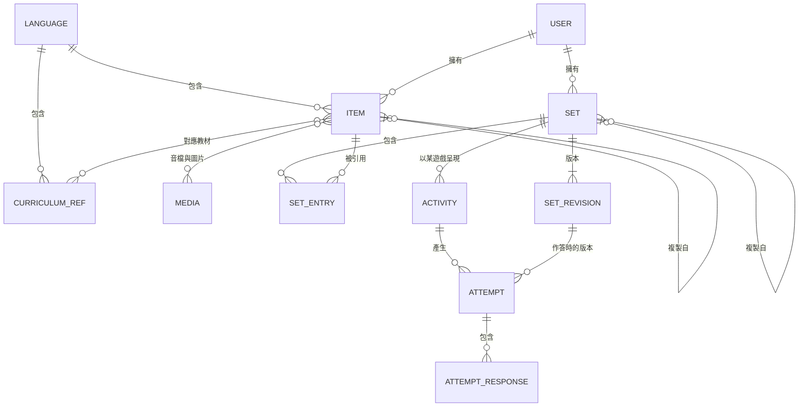

# Kancil Quiz 規格書

> **Kancil Quiz**（kancil 是印尼語、馬來語的「鼷鹿」，取其機伶頑皮之意）：給新住民語文老師的互動練習平台。以共備語料為核心，同一份語料可以切換成多種遊戲，是 Wordwall 的開源替代方案。

| 項目 | 內容 |
|---|---|
| 版本 | v0.1.4（草案） |
| 日期 | 2026-10-03 |
| 維護者 | 許家雋 |
| 狀態 | M1 實作中：主要流程已可端對端運作，待教師試用 |
| 修訂 | v0.1.4：M1 實作中的調整。ULID 用大寫且每次重新取隨機值（第 5 節）；PHP 測試改用 PHPUnit；媒體在上傳請求中同步轉檔（第 9 節）；新增 D-13（介面字串 i18n）、D-14（迷宮字型大小）<br>v0.1.3：專案定名為 Kancil Quiz（D-1）；語料全部自製，不匯入國教署教材（D-4）；教師社群調查擱置，M0 不再等待調查結果<br>v0.1.2：整合審閱意見。新增題組版本（3.3）、題組可見性定義與分享連結（T-17）、遊戲相容規則（7.3）與伺服器判分（7.4）、活動播放格式（6.6）；複製題組改為複製詞條；授權改記在詞條與媒體上；M1 縮為兩個遊戲<br>v0.1.1：第一階段語言範圍限定為印尼語與越南語，其餘語言分兩階段擴充（見 1.4） |

---

## 1. 背景與目標

### 1.1 背景

- 國小新住民語文教學支援人員的教師社群，在培訓中學習用 Wordwall 製作互動練習，但 Wordwall 費用高，使用上也有不便。
- 評估過 H5P 後決定不採用為平台。H5P 適合測驗型練習，但缺少街機型遊戲，無法讓同一份內容切換多種模板；Drupal 整合模組目前無人維護；OER Hub 上幾乎沒有給這群受眾的內容。H5P 只保留為日後的匯出格式選項。
- 已經有一個自製的 Maze chase 遊戲（TypeScript），試玩評價良好，會作為第一個遊戲模組。

### 1.2 目標

1. **語料優先**：詞條與題組是核心資產，遊戲只是讀取語料的呈現方式。
2. **一份語料、多種遊戲**：同一個題組可以一鍵切換成不同遊戲，對應 Wordwall 的「切換模板」。
3. **共備**：老師可以分享、複製、改編彼此的題組。
4. **可攜**：語料有公開的交換格式，可以完整匯出；遊戲能脫離後端獨立執行。
5. **低維運**：一個人就能維護，單台主機即可運作。
6. **開源**：程式碼與語料都以開放授權釋出。

### 1.3 非目標（v1 不做）

- 學生帳號與登入
- LTI、完整的 LRS
- 即時多人對戰
- 原生 App（網頁支援平板即可）
- 與 H5P 平台整合（.h5p 匯出器列為後期選項）
- 網站頁面編輯（這不是網站 CMS）

### 1.4 語言支援範圍

語言分階段開放。架構一開始就以七種語言為前提設計，但測試與內容只要求已開放的語言。

| 階段 | 語言 | 理由 |
|---|---|---|
| 第一階段（M0 到 M4） | 印尼語 `id`、越南語 `vi` | 優先支援的教學語言 |
| 語言擴充一（M5） | 馬來語 `ms`、菲律賓語 `fil` | 同為拉丁字母，新增成本低；馬來語與印尼語相近 |
| 語言擴充二（M6） | 泰語 `th`、柬埔寨語 `km`、緬甸語 `my` | 複雜文字，需要字型、斷詞、編碼等額外工作（見第 8 節） |

擴充的順序是建議，可依教師社群的需求調整（見 D-10）。

第一階段的原則：

- 未開放的語言不出現在老師端的選單中（由 `languages.enabled` 控制）。
- 程式仍須遵守第 8 節的文字處理規則，例如一律用 `graphemes()` 切字。這樣之後開放複雜文字時，不必改寫遊戲。
- 本文件中標示「（M6）」的項目，第一階段不實作。

---

## 2. 使用者與角色

| 角色 | 說明 | 主要權限 |
|---|---|---|
| 學生（訪客） | 國小學生，透過連結或 QR code 遊玩 | 遊玩活動、送出作答，不需帳號 |
| 老師 `teacher` | 新住民語文教學支援人員 | 建立與編輯自己的詞條、題組、活動；檢視自己活動的成績；複製別人公開或分享的題組 |
| 審核者 `curator` | 各語言的資深老師 | 審核題組公開申請、標記重複詞條、修正公開語料 |
| 管理員 `admin` | 平台維護者 | 帳號、語言、教材對照表等設定 |

角色以 `spatie/laravel-permission` 實作。審核者的權限可以限定在特定語言。

---

## 3. 核心概念



### 3.1 詞條（Item）

語料的最小單位：一個詞或短句在某種語言中的表示。

| 欄位 | 說明 |
|---|---|
| `text` | 目標語文字，以 NFC 正規化後儲存 |
| `romanization` | 羅馬拼寫，選填（泰、緬、柬語建議填寫） |
| `translation_zh` | 中文意思 |
| `audio` | 發音音檔，選填，可以有多個（例如不同發音者）。每個檔案各自記錄作者、出處、授權 |
| `image` | 圖片，選填。同樣各自記錄作者、出處、授權 |
| `language` | 語言代碼（見附錄 A） |
| `curriculum_refs` | 對應教材的冊與課，多對多 |
| `tags` | 標籤 |
| `owner` | 擁有者，只有擁有者（與審核者）能修改 |
| `license`、`authors`、`source` | 授權、作者（署名用，可以有多位）、出處 |

詞條屬於建立它的老師，題組只引用擁有者自己的詞條。複製別人的題組時，詞條也一併複製，之後原作者修改原詞條，不會影響複製出去的題組（見第 5 節）。

### 3.2 題組（Set）

老師出題的單位，對應 Wordwall 的一份活動內容。v1 支援兩種題組：

- **`vocab`（詞彙組）**：有序的詞條清單。由 `faces` 設定決定哪一面當題目、哪一面當答案，例如「看中文選越南文」「聽音檔選圖片」。
- **`quiz`（問答組）**：有序的問題清單，每題有題幹與 2 到 6 個選項，v1 每題恰有一個正解（多個正解見 D-11）。選項可以是文字或圖片，題幹可以附圖片或音檔。

v2 預計加入 `group`（分類）與 `sentence`（重組句子）。

題組的可見性：

| 可見性 | 誰能檢視與複製 | 誰能匯出 | 列在共備庫 |
|---|---|---|---|
| `private` | 擁有者 | 擁有者 | 否 |
| `unlisted` | 拿到題組連結的老師（需登入） | 同左 | 否 |
| `public` | 所有老師（需登入） | 任何人，不需登入（開放資料） | 是 |

題組要經審核者通過（`review_status` 為 `approved`）才能設為 `public`。審核者可以檢視自己負責語言中待審的題組。

老師端不提供三選一的可見性選單。題組預設為 `private`；題組頁有「產生分享連結給同事」按鈕（T-17），按下後改為 `unlisted`，收回時改回 `private`。收回只會擋住之後的存取，已經被複製出去的題組不受影響。公開則走申請與審核（T-12）。

`unlisted` 與活動連結的差別在對象：活動連結給學生遊玩，題組的分享連結給老師複製改編。

### 3.3 題組版本（SetRevision）

題組的內容每次變動，系統就自動產生一個不可變的版本，讓作答紀錄永遠能對照到學生當時看到的題目。

- 題組本身或其中任何詞條修改並儲存後，系統以題組當下的內容產生新版本。版本的內容就是匯出用的 `set.json`（見第 6 節）；內容與上一版相同時不產生新版本。
- 老師端沒有「發布」步驟。活動一律使用題組的最新版本，所以老師修正錯字後，已發出的連結與 QR code 立即生效。
- 每筆作答記下它使用的版本，成績與答錯的題目都依該版本解讀，不受之後的修改影響。結果頁涵蓋多個版本時要標示出來。
- 版本引用的媒體檔不可修改：替換音檔或圖片時會產生新的媒體，舊的等到沒有任何版本引用時才清除（見第 5 節）。

### 3.4 活動（Activity）

「題組＋遊戲＋遊戲設定」的組合，是分享的單位，有自己的網址與 QR code。同一個題組可以建立多個活動，這就是「切換模板」。活動指向題組而不是特定版本，播放時一律使用最新版本（見 3.3）。

活動的遊玩連結與題組的可見性無關：持有連結的人都能遊玩，題組是 `private` 也一樣。活動連結本身就是存取憑證。

活動分兩種模式：

- **練習模式**：開了就玩，不記名。
- **作業模式**：學生必須先輸入暱稱或座號，老師可以看到每位學生的成績。

### 3.5 作答（Attempt）

學生玩一次活動會產生一筆 Attempt，內含逐題的作答紀錄。欄位設計對應 xAPI statement 的結構，方便日後匯出，但 v1 不接 LRS。正式成績由伺服器依作答時的題組版本判定，不採信玩家端回報的分數（見 7.4）。

### 3.6 教材對照（CurriculumRef）

對應國教署新住民語文數位學習教材的「語言／冊／課」，方便老師依課次找題組。**只存對照資訊，不存教材內容**。平台的語料全部自製，不匯入國教署教材的文字、圖片或音檔（見 D-4）。

---

## 4. 功能需求

優先順序：**M** = MVP 必備，**S** = 應該要有，**C** = 有餘力再做。

### 4.1 老師

| ID | 需求 | 優先 |
|---|---|---|
| T-01 | 以 email 與密碼登入（Fortify） | M |
| T-02 | 邀請制註冊：由管理員或審核者發邀請連結，避免任意註冊 | M |
| T-03 | 以 Google 帳號登入（Socialite） | S |
| T-04 | 建立詞彙組：逐列輸入，或一次貼上多行「目標語`<Tab>`中文」文字 | M |
| T-05 | 為詞條上傳音檔與圖片 | M |
| T-06 | 在瀏覽器中直接錄音（MediaRecorder） | S |
| T-07 | 建立問答組：題幹加 2 到 6 個選項，標示一個正解 | M |
| T-08 | 為題組選擇遊戲、調整設定、預覽。只能選與題組相容的遊戲；不相容的遊戲要說明是哪幾題、缺少什麼（見 7.3） | M |
| T-09 | 產生分享連結與 QR code；提供投影模式（大字、全螢幕） | M |
| T-10 | 同一題組一鍵換成其他遊戲（建立新活動） | M |
| T-11 | 檢視自己活動的作答紀錄與逐題答錯率 | S |
| T-12 | 申請將題組公開到共備庫 | S |
| T-13 | 依語言、冊、課、標籤瀏覽與搜尋共備庫，複製後改編 | S |
| T-14 | 建立作業模式的活動，可設定開放與截止時間 | S |
| T-15 | 將題組匯出為交換格式的 zip | S |
| T-16 | 匯入 zip 或 CSV | C |
| T-17 | 產生題組的分享連結給同事，讓對方不必經過審核就能檢視與複製；可以隨時收回（見 3.2） | S |

### 4.2 學生

| ID | 需求 | 優先 |
|---|---|---|
| S-01 | 開啟連結即可遊玩，不需帳號 | M |
| S-02 | 平板直向、橫向都能玩，支援觸控 | M |
| S-03 | 結束時顯示結果：計分的遊戲顯示答對題數，並列出答錯的題目（可播放發音）；不計分的遊戲（例如字卡）顯示看過的張數 | M |
| S-04 | 作業模式下輸入暱稱或座號 | S |
| S-05 | 網路短暫中斷時可以繼續玩，恢復連線後補送作答 | C |

### 4.3 審核者

| ID | 需求 | 優先 |
|---|---|---|
| C-01 | 審核公開申請：通過，或附意見退回 | S |
| C-02 | 把重複的公開詞條標為同一組，在共備庫中合併顯示，保留各自的音檔與出處。不刪除或改寫任何人的詞條 | C |
| C-03 | 編輯公開語料，並保留修訂紀錄 | S |

### 4.4 管理員

| ID | 需求 | 優先 |
|---|---|---|
| A-01 | Filament 後台：管理使用者、角色、語言、教材對照表 | M |
| A-02 | 檢視系統狀態：佇列、儲存空間、備份結果 | S |

### 4.5 開放資料

| ID | 需求 | 優先 |
|---|---|---|
| O-01 | 每晚將公開語料匯出為交換格式，推送到公開的 Git repo | C |
| O-02 | 獨立播放器：只用靜態檔案就能播放匯出的題組 | S |
| O-03 | .h5p 匯出器（`vocab` 轉 Dialog Cards，`quiz` 轉 Question Set） | C |

---

## 5. 資料模型

公開識別碼一律用 ULID（網址、匯出檔中不暴露遞增 ID），採標準的大寫形式。隨機部分每次都重新取 80 位元：同一毫秒內不可只把隨機部分加一，否則相鄰建立的活動連結可以互相推算（活動連結本身就是存取憑證，見 3.4）。以下只列主要欄位。

| 資料表 | 主要欄位 | 說明 |
|---|---|---|
| `users` | `id`、`name`、`email`、`password`、`locale` | Fortify 預設欄位 |
| `languages` | `code`（PK）、`name_zh`、`name_native`、`script`、`word_spacing`（bool）、`enabled`（bool） | 預建 7 種語言，第一階段只開放 `id`、`vi`；見附錄 A |
| `curriculum_refs` | `id`、`language_code`、`volume`、`lesson`、`title_zh` | 教材冊課對照 |
| `media` | `id`（ULID）、`kind`（`audio`／`image`）、`path`、`mime`、`bytes`、`duration_ms`、`width`、`height`、`authors`（json）、`license`、`source`、`uploaded_by` | 轉檔完成後的檔案。檔案內容不可變，署名資料可以修正 |
| `items` | `id`（ULID）、`language_code`、`text`、`romanization`、`translation_zh`、`tags`（json）、`owner_id`、`authors`（json）、`license`、`source`、`forked_from_id` | soft delete |
| `item_media` | `item_id`、`media_id`、`role`（`audio`／`image`）、`position` | 詞條的音檔與圖片 |
| `item_curriculum_ref` | `item_id`、`curriculum_ref_id` | 樞紐表 |
| `sets` | `id`（ULID）、`kind`（`vocab`／`quiz`）、`title`、`description`、`language_code`、`owner_id`、`visibility`（`private`／`unlisted`／`public`）、`review_status`（`none`／`pending`／`approved`／`rejected`）、`faces`（json）、`forked_from_id`、`license`、`current_revision_id` | soft delete |
| `set_entries` | `id`（ULID）、`set_id`、`position`、`item_id`（vocab 用）、`payload`（json，quiz 用） | quiz 題幹與選項的媒體以 `media` 的 ID 寫在 `payload` 中 |
| `set_revisions` | `id`（ULID）、`set_id`、`number`、`content`（json，交換格式）、`content_hash`、`created_by`、`created_at` | 不可變，見 3.3 |
| `activities` | `id`（ULID）、`set_id`、`game_id`、`game_version`、`options`（json）、`mode`（`practice`／`assignment`）、`opens_at`、`closes_at`、`owner_id` | 播放時使用題組的 `current_revision_id` |
| `attempts` | `id`（ULID）、`activity_id`、`set_revision_id`、`seed`、`player_label`、`token_hash`、`started_at`、`completed_at`、`correct_count`、`round_count`、`game_score`、`duration_ms` | `correct_count`、`round_count` 由伺服器計算，不計分的遊戲 `correct_count` 為 null；`game_score` 由遊戲回報，只供顯示（見 7.4）。不存 IP |
| `attempt_responses` | `id`、`attempt_id`、`entry_id`、`presented`（json）、`selected`（json）、`correct`、`client_correct`、`duration_ms`、`created_at` | `entry_id` 對應版本內容中的 entry，不設外鍵；`correct` 由伺服器判定。不計分的遊戲只記錄看過哪些題，`selected`、`correct` 為 null |
| `activity_log` | spatie/laravel-activitylog 預設欄位 | 語料的修訂紀錄 |

規則：

- 所有文字欄位寫入前以 NFC 正規化（見第 8 節）。
- 題組被複製時，詞條也一併複製：新題組的 `forked_from_id` 指向原題組，新詞條的 `forked_from_id` 指向原詞條，`authors` 沿用原作者。之後原作者或審核者修改原詞條，不影響複製出去的題組。
- 複製的詞條與原詞條引用同一批 `media`，不複製媒體檔（媒體檔不可變，共用是安全的）。
- 老師修改複製來的詞條時，把自己加進該詞條的 `authors`。
- 詞條沒有自己的可見性，由引用它的題組決定。
- 媒體在沒有任何詞條、問答題或題組版本引用時，由排程任務清除。
- 作答紀錄預設保存 12 個月，由排程任務清除（可設定）。沒有作答引用、也不是最新版本的題組版本一併清除。

---

## 6. 語料交換格式（Kancil Set Format v1）

交換格式是整個專案的「公共契約」：匯出、匯入、題組版本、獨立播放器、公開資料集都用同一份格式。

專案中有三份契約，用途不同：

| 契約 | 定義位置 | 用途 |
|---|---|---|
| 題組交換格式（本節） | `set.v1.schema.json` | 可攜的題組內容：匯出檔、題組版本、公開資料集 |
| 活動播放格式（6.6） | `activity.v1.schema.json` | 播放 API 的回應：活動設定加上題組內容 |
| `Round`（7.2） | `@kancil-quiz/games-sdk` 的 TS 型別 | 宿主轉換後交給遊戲的題目，只存在於瀏覽器記憶體中，不在網路上傳輸，不另訂 JSON Schema |

### 6.1 規格來源

- JSON Schema 放在 `packages/schema/`（`set.v1.schema.json`、`activity.v1.schema.json`），是**唯一的規格來源**。
- TypeScript 型別由 `json-schema-to-typescript` 自動產生，不手寫。
- Laravel 以 `opis/json-schema` 驗證匯入檔與 API 輸出。
- CI 必須檢查：schema 變更時，產生的型別與測試用 fixture 同步更新。
- 用同一批 fixture 測兩條路徑：「匯出 → 匯入 → 再匯出」結果相同；「題組 → `Round[]`」的轉換結果與預期一致。

### 6.2 zip 結構

```
set-01M3ZYQZ9RJK6VGH2N6XVR9QTH.zip
├── set.json
├── media/
│   ├── 01M3ZYR188M6EWJQJWHW2KP6YE.m4a
│   └── 01M3ZYR27GF5QQW62SVZ5NA266.webp
└── LICENSE.txt
```

媒體檔以媒體的 ID 命名。`LICENSE.txt` 列出題組的授權，以及所有授權或作者與題組不同的詞條與媒體的署名。

### 6.3 詞彙組範例

```json
{
  "format": "kancil-set",
  "version": 1,
  "id": "01M3ZYQZ9RJK6VGH2N6XVR9QTH",
  "kind": "vocab",
  "language": "vi",
  "title": "第 3 冊第 2 課：水果",
  "license": "CC-BY-4.0",
  "authors": [{ "name": "王老師" }],
  "curriculum": [{ "volume": 3, "lesson": 2 }],
  "faces": {
    "prompt": ["translation_zh", "image"],
    "answer": ["text"]
  },
  "entries": [
    {
      "id": "01M3ZYR090HSK1QGN8BZGK07M3",
      "item": {
        "text": "quả chuối",
        "romanization": null,
        "translation_zh": "香蕉",
        "audio": [
          { "src": "media/01M3ZYR188M6EWJQJWHW2KP6YE.m4a" }
        ],
        "image": {
          "src": "media/01M3ZYR27GF5QQW62SVZ5NA266.webp",
          "authors": [{ "name": "李老師" }],
          "license": "CC-BY-4.0",
          "source": "自行拍攝"
        }
      }
    }
  ]
}
```

### 6.4 問答組範例

```json
{
  "format": "kancil-set",
  "version": 1,
  "id": "01M3ZYR36RHMWPTEYDYQQN7526",
  "kind": "quiz",
  "language": "vi",
  "title": "打招呼",
  "license": "CC-BY-4.0",
  "authors": [{ "name": "王老師" }],
  "entries": [
    {
      "id": "01M3ZYR460BP4AAE9S6E26T3VJ",
      "question": {
        "stem": { "text": "「謝謝」的越南語是？", "audio": null, "image": null },
        "options": [
          { "id": "a", "text": "cảm ơn", "correct": true },
          { "id": "b", "text": "xin chào", "correct": false },
          { "id": "c", "text": "tạm biệt", "correct": false }
        ]
      }
    }
  ]
}
```

### 6.5 格式規則

- 所有文字一律為 NFC。
- 媒體一律以物件表示（`{ "src": ... }`），不用純字串，以便附上署名資料。`src` 為 zip 內的相對路徑；API 輸出時由伺服器改寫為絕對網址。
- 詞條與媒體的 `authors`、`license`、`source` 為選填，省略時沿用外層（媒體沿用詞條，詞條沿用題組）。6.3 範例中的音檔沿用題組的作者與授權，圖片則另有作者與出處。
- `quiz` 的每一題恰有一個選項為 `"correct": true`（多個正解見 D-11）。
- `faces` 可用的欄位：`text`、`romanization`、`translation_zh`、`audio`、`image`。
- 新增**選填**欄位不升版；任何會讓舊檔案失效的變更都要升到 `version: 2`，並提供 v1 → v2 的轉換器。

### 6.6 活動播放格式

`GET /api/v1/activities/{activity}` 的回應。題組部分就是交換格式，只有媒體路徑改成絕對網址：

```json
{
  "format": "kancil-activity",
  "version": 1,
  "id": "01M3ZYR558VKZ7K29AX3CQE4RE",
  "game": { "id": "maze-chase", "version": "1.0.0", "options": { "speed": "normal" } },
  "mode": "practice",
  "set_revision_id": "01M3ZYR64GE46YKF988H7P96VJ",
  "set": { "format": "kancil-set", "version": 1, "id": "01M3ZYQZ9RJK6VGH2N6XVR9QTH" }
}
```

`set` 的其餘欄位與 6.3 相同，此處省略。播放器開始作答時要把 `set_revision_id` 一起送回（見 10.3），因為老師可能在學生載入頁面之後又修改了題組。

---

## 7. 遊戲模組規格

### 7.1 原則

- 每個遊戲是 monorepo 中的一個獨立套件，用 TypeScript 撰寫，**不依賴 Vue 或 Laravel**。遊戲內部可以用 Canvas、DOM 或任何技術，只要掛載到宿主給的元素上。
- 遊戲**不直接存取網路**。題目、設定、媒體網址都由宿主透過 context 提供；作答結果以事件回報，由宿主負責儲存。
- 遊戲只處理「已轉換好的題目形狀」（見 7.2 的 `Round`）。把詞彙組轉成選擇題、產生干擾選項等工作由宿主透過 `@kancil-quiz/deck` 完成，所以遊戲本身不需要理解兩種題組。
- 遊戲以宣告的方式說明自己能接受什麼樣的題目（`requires`），宿主依此判斷題組能不能套用這個遊戲（見 7.3）。
- 遊戲不判定正式成績。遊戲可以用 `Round` 中的 `correct` 即時給回饋，但成績由伺服器重算（見 7.4）。
- 必須同時支援觸控與滑鼠；合理的情況下也支援鍵盤。
- 文字比對與切字一律使用 `@kancil-quiz/text`（見第 8 節），不得自行用 `split('')` 之類的方式切字。

### 7.2 介面定義

```ts
// packages/games-sdk/src/index.ts

export interface Face {
  text?: string;
  romanization?: string;
  audio?: string;   // 已解析的網址
  image?: string;   // 已解析的網址
}

export type Round =
  | { shape: 'mcq'; entryId: string; prompt: Face; options: { id: string; face: Face; correct: boolean }[] }
  | { shape: 'pair'; entryId: string; left: Face; right: Face }
  | { shape: 'card'; entryId: string; front: Face; back: Face };

export type FaceSlot = 'prompt' | 'option' | 'left' | 'right' | 'front' | 'back';

export interface GameRequirements {
  shape: Round['shape'];               // 這個遊戲需要的題目形狀
  minRounds: number;
  optionCount?: { min: number; max: number };            // 僅 mcq：每題的選項數
  renders: Partial<Record<FaceSlot, (keyof Face)[]>>;    // 各位置能呈現的欄位
  scored: boolean;                     // 是否計分；字卡為 false
}

export interface GameModule<Options = Record<string, unknown>> {
  id: string;                          // 例：'maze-chase'
  version: string;                     // semver
  title: { 'zh-TW': string };
  requires: GameRequirements;
  optionsSchema: object;               // JSON Schema，老師端的設定表單依此自動產生
  defaultOptions: Options;
  mount(el: HTMLElement, ctx: GameContext<Options>): GameInstance;
}

export interface GameContext<Options> {
  rounds: Round[];
  options: Options;
  language: string;                    // 題組語言，例：'th'
  uiLocale: 'zh-TW';
  rng: () => number;                   // 可重現的亂數，方便除錯與測試
  audio: {
    play(url: string): Promise<void>;
    stopAll(): void;
  };
  emit(event: GameEvent): void;
}

export interface GameInstance {
  destroy(): void;
  pause?(): void;
  resume?(): void;
}

export type GameEvent =
  | { type: 'started' }
  | {
      type: 'answered';
      entryId: string;
      selected: string[];              // mcq 為選項 id；pair 為配到的右側卡片的 entryId。v1 一律只有一個元素
      correct: boolean;                // 遊戲自己的判定，只用於即時回饋（見 7.4）
      durationMs: number;
    }
  | { type: 'viewed'; entryId: string }               // 不計分的遊戲（例如字卡）
  | { type: 'completed'; gameScore?: number; durationMs: number };  // gameScore 為遊戲自己的得分，只供顯示
```

宿主（`@kancil-quiz/player`）負責：

1. 取得活動設定與題組的最新版本（見 6.6）。
2. 依遊戲的 `requires`，用 `@kancil-quiz/deck` 把題組轉成 `Round[]`（見 7.3），並在此時產生亂數種子。
3. 顯示「開始」按鈕，藉由使用者手勢解鎖 iOS 的音訊播放，然後呼叫 `mount()`。
4. 收集事件，補上每題出現了哪些選項，批次送到 API；匯出時轉換成 xAPI statement。
5. 沒有伺服器時（獨立播放器），以同一套規則在本機判定成績（見 7.4）。

### 7.3 相容規則與轉換

`@kancil-quiz/deck` 依下表把題組轉成遊戲需要的形狀：

| 題組 | `mcq` | `pair` | `card` |
|---|---|---|---|
| `vocab` | 題目為 `faces.prompt`，正解為該詞條的 `faces.answer`，干擾選項從同題組其他詞條的 `faces.answer` 抽出 | 左為 `faces.prompt`，右為 `faces.answer` | 正面為 `faces.prompt`，背面為 `faces.answer` |
| `quiz` | 直接使用題幹與選項 | 左為題幹，右為正解選項 | 正面為題幹，背面為正解選項 |

`deck.check(set, requires)` 依下列條件判斷題組能不能套用某個遊戲，不相容時回傳是哪幾題、缺少什麼：

- 題數不少於 `minRounds`。
- 每個面至少要有一個欄位是遊戲在該位置能呈現的（`renders`）。例如迷宮的選項只能呈現文字或圖片，答案面只有音檔的詞彙組就不相容。
- `vocab` 轉 `mcq`：干擾選項的答案面不可與正解相同（文字以 `isMatch()` 比對），所以題組中互不相同的答案面要夠多，才湊得滿 `optionCount.min`。
- `quiz` 轉 `mcq`：選項少於 `optionCount.min` 時不相容；多於 `optionCount.max` 時，保留正解並隨機抽出干擾選項到上限，建立活動時提示老師。
- 轉 `pair`：右側的內容不可重複，否則配對沒有唯一解。

建立活動時（T-08）只能選相容的遊戲；不相容的遊戲仍列出，但不能選，並顯示原因。老師修改題組時，若某個既有活動會因此變得不相容，儲存前要提示。學生開啟不相容的活動時，播放頁顯示「此活動暫時無法遊玩」，不讓遊戲當掉。

### 7.4 成績判定

- 遊戲回報學生選了什麼（`selected`），宿主補上該題出現的選項（`presented`），送到伺服器。
- 伺服器依作答時的題組版本重新判定對錯。`attempt_responses.correct` 與 `attempts.correct_count` 一律以伺服器的判定為準；遊戲回報的 `correct` 另存為 `client_correct`，用來發現遊戲本身的判定錯誤。
- 同一題有多筆作答時（例如迷宮答錯後重試），答對率以第一筆為準。
- 遊戲自己的得分（例如迷宮的分數、連擊）存在 `attempts.game_score`，只供顯示，不當作成績。
- 判定規則在 Laravel 與 `@kancil-quiz/deck` 各實作一份，後者供獨立播放器在本機判定。兩份實作共用同一批 fixture 測試，確保結果一致。
- 題目與正解必須送到瀏覽器才能即時回饋，所以作業模式的成績定位為**形成性的練習紀錄**，不是防作弊的測驗。

### 7.5 v1 遊戲清單

| id | 名稱 | 需要的形狀 | 計分 | 說明 | 對應 Wordwall 模板 |
|---|---|---|---|---|---|
| `maze-chase` | 迷宮追逐 | `mcq` | 是 | 將既有實作改寫為模組。每關迷宮自動生成；點擊方向後角色朝該方向前進，不自動轉彎 | Maze chase |
| `quiz` | 選擇題 | `mcq` | 是 | 題幹可附圖片與音檔 | Quiz |
| `flash-cards` | 字卡 | `card` | 否 | 翻面、播放發音；只記錄看過哪些卡 | Flash cards |
| `match-up` | 配對 | `pair` | 是 | 拖曳配對 | Match up |

M1 只做 `maze-chase` 與 `quiz`，`flash-cards` 與 `match-up` 在 M2 加入（見第 13 節）。

v2 候選：分類（group sort）、重組句子（unjumble）、打地鼠（whack-a-mole）、找字（word search，以字素為單位）、口說卡、轉盤。實際順序依試用老師的回饋決定（教師社群調查目前擱置，見 M0）。

### 7.6 遊戲驗收條件

每個遊戲模組合併前必須通過：

- `check()` 判定為相容的 fixture 題組都能完整玩完一輪；判定為不相容的，老師端顯示正確的原因。
- 計分的遊戲：跑完 fixture 題組後，遊戲回報的 `correct` 與 `@kancil-quiz/deck` 的判定完全一致。
- 以已開放語言的 fixture 題組（第一階段為 `id`、`vi`）各跑一次 Playwright 截圖測試（iPad 直向、橫向，以及 1920×1080 投影尺寸）。
- 越南文的疊加聲調符號完整顯示，在投影與小螢幕尺寸下都沒有被截切。
- 另跑一份泰文 fixture 作為**非必過**的預警測試，提早發現違反切字規則的程式；M6 起改為必過，並加入緬、柬文。
- 在「開始」之前不播放任何聲音；`destroy()` 之後沒有殘留的計時器或事件監聽。

---

## 8. 文字處理規格（`@kancil-quiz/text`）

東南亞文字是這個專案最容易出錯的地方，所以集中在一個套件處理，所有遊戲與表單共用。第一階段需實作正規化、答案比對、切字與越南文字型；標示「（M6）」的項目延後。

| 功能 | 規格 |
|---|---|
| 正規化 | 儲存與比對前一律轉 NFC。伺服器端用 PHP `Normalizer::normalize($s, Normalizer::FORM_C)`（需 `ext-intl`），前端用 `s.normalize('NFC')` |
| 答案比對 `isMatch()` | NFC → 去除頭尾空白 → 合併連續空白 → 拉丁字母語言（vi、id、ms、fil）不分大小寫。另有「寬鬆模式」可忽略聲調與變音符號，**預設關閉**，由老師在活動設定中開啟（越南語的聲調有辨義作用） |
| 切字 `graphemes()` | 使用 `Intl.Segmenter(lang, { granularity: 'grapheme' })`。凡是把文字拆成格子或字塊的遊戲都必須用它，禁止以 code unit 或 code point 切字 |
| 斷詞建議 `suggestWords()`（M6） | 泰、緬、柬文詞與詞之間沒有空格。建立重組句子題時，用 `Intl.Segmenter` 的 word 模式提供斷詞建議，由老師確認後把斷好的詞存起來；遊戲一律使用儲存的結果，因為各瀏覽器的斷詞結果不一致 |
| 緬甸文 Zawgyi 偵測（M6） | 部分緬甸語使用者的裝置仍使用舊的 Zawgyi 編碼。輸入時偵測（候選：Google `myanmar-tools`，採用前確認授權），若判定為 Zawgyi 就提示轉換為 Unicode；資料庫只存 Unicode |
| 字型（第一階段） | 介面與遊戲使用的字型必須涵蓋越南文字元。若自架網頁字型，要載入 `vietnamese` subset，否則部分字母會退回系統字型，造成字形不一致。越南文字母上方可能疊兩層符號，行高不可過緊 |
| 字型（M6） | 自架 Noto Sans Thai、Noto Sans Myanmar、Noto Sans Khmer（SIL OFL），設定 `font-display: swap`。緬甸文與高棉文的上下附加符號多，行高需加大，需逐一目視檢查 |

---

## 9. 音訊與媒體

| 項目 | 規格 |
|---|---|
| 可上傳的音檔 | mp3、m4a／aac、wav、ogg、webm，單檔上限 5 MB |
| 音檔轉檔 | 以 ffmpeg 統一轉成 AAC（`.m4a`，單聲道），並做音量標準化（EBU R128 `loudnorm`），讓不同老師錄的音量一致；確保 iPad 能播放。M1 在上傳的請求中同步轉檔，老師上傳後立即能聽到結果；使用量上升後再改成佇列任務 |
| 瀏覽器錄音 | MediaRecorder 錄製的格式因瀏覽器而異，一律上傳後再轉檔 |
| 圖片 | jpg、png、webp，上限 5 MB；轉成長邊最多 1024 px 的 WebP，另產生縮圖 |
| 播放 | 遊戲開始前由使用者手勢解鎖音訊；預先載入下一題的音檔 |
| 儲存 | M1 使用 Laravel filesystem 的本機 `public` disk，檔名為隨機產生的字串，不可猜測。媒體網址的保護程度與活動連結相同：持有活動連結的人本來就能載入題組的所有媒體。媒體目錄不可列出內容，回應加上 `X-Robots-Tag: noindex`。是否改為私人 disk 加限時網址，在 M2 共備庫上線前決定（見 D-12）。之後可換成 S3 相容儲存 |
| 不可變 | 媒體檔上傳轉檔後就不再修改。替換音檔或圖片時產生新的媒體，舊的等到沒有任何詞條、問答題或題組版本引用時，由排程清除 |
| 權利聲明 | 上傳時老師需確認有權分享此檔案，並填寫作者、出處，選擇授權（預設值見 D-3）。這些資料記在媒體上，不依賴題組的授權，因為同一個媒體可能被多個題組引用 |

---

## 10. 系統架構

### 10.1 技術選型

| 層 | 選擇 | 備註 |
|---|---|---|
| 後端 | PHP 8.4+、Laravel 13 | 以 Laravel 官方的 Vue starter kit 起始 |
| 老師端介面 | Inertia v3、Vue 3、TypeScript、Tailwind CSS 4、shadcn-vue | starter kit 內建 |
| 驗證 | Laravel Fortify（starter kit 內建）；Google 登入用 Socialite | 老師帳號可啟用 2FA |
| 管理後台 | Filament | 只給管理員與審核者使用，不做客製 |
| 權限／修訂 | spatie/laravel-permission、spatie/laravel-activitylog | |
| 媒體 | 自建 `media` 資料表（見第 5、9 節）；音檔用 ffmpeg、圖片用 `intervention/image` 轉檔 | 不用 medialibrary：媒體需要不可變、可被多個詞條共用、各自記錄授權，這些都不是 medialibrary 的設計方向 |
| JSON Schema 驗證 | opis/json-schema | |
| 資料庫 | MVP 用 SQLite（WAL 模式）；使用量上升後遷移到 PostgreSQL | 見 D-9 |
| 佇列 | database driver；伺服器安裝 ffmpeg | 轉檔、匯出 |
| 前端套件管理 | npm workspaces，Node 22+ | |
| 測試 | PHPUnit（PHP，starter kit 預設）、Vitest（TS，經由 Vite+）、Playwright（E2E，含 iPad 模擬） | |
| 開發輔助 | Laravel Boost（讓 Claude Code 等 AI 代理讀取專案結構的 MCP server）、Pint、Larastan | |

### 10.2 Repo 結構

```
kancil-quiz/
├── app/                        # Laravel
├── database/
├── resources/js/
│   ├── pages/                  # Inertia 頁面（老師端）
│   ├── components/
│   └── player.ts               # 播放頁的獨立 Vite 入口，不經過 Inertia
├── packages/
│   ├── schema/                 # JSON Schema（題組、活動）、自動產生的 TS 型別、fixture
│   ├── text/                   # 文字處理（第 8 節）
│   ├── deck/                   # 題組轉 Round、干擾選項、相容檢查、成績判定（第 7.3、7.4 節）
│   ├── games-sdk/              # 遊戲介面定義（第 7.2 節）
│   ├── player/                 # 遊戲宿主；可另外建置成獨立播放器
│   └── games/
│       ├── maze-chase/
│       ├── quiz/
│       ├── flash-cards/
│       └── match-up/
├── tests/
└── docs/
    ├── SPEC.md                 # 本文件
    └── game-module-guide.md
```

**播放頁不使用 Inertia**：學生端要盡量輕量，而且要與獨立播放器共用同一套程式碼，所以用獨立的 Vite 入口 `player.ts` 載入 `@kancil-quiz/player`。

### 10.3 路由

老師端（Inertia，需登入）：

| 路徑 | 用途 |
|---|---|
| `/dashboard` | 我的題組與活動 |
| `/sets`、`/sets/create`、`/sets/{set}/edit` | 題組管理 |
| `/sets/{set}/activities/create` | 為題組建立活動（選遊戲） |
| `/activities/{activity}` | 活動設定、分享連結、QR code |
| `/activities/{activity}/results` | 作答結果 |
| `/library` | 共備庫 |
| `/admin` | Filament 後台 |

學生端與公開 API（不需登入，依 IP 限流但不儲存 IP）：

| 方法與路徑 | 用途 |
|---|---|
| `GET /p/{activity}` | 播放頁 |
| `GET /api/v1/activities/{activity}` | 取得活動設定與題組的最新版本（活動播放格式，見 6.6） |
| `POST /api/v1/activities/{activity}/attempts` | 開始作答，帶 `set_revision_id` 與 `seed`，可帶 `player_label`；回傳 `attempt_id` 與一次性 `token` |
| `POST /api/v1/attempts/{attempt}/responses` | 批次送出作答紀錄（選了什麼、出現了哪些選項），需帶 `token`；伺服器重新判定對錯 |
| `POST /api/v1/attempts/{attempt}/complete` | 結束作答，可帶遊戲自己的得分；伺服器彙總答對題數 |
| `GET /api/v1/sets/{set}/export` | 下載 zip；權限依題組的可見性（見 3.2） |

---

## 11. 非功能需求

| 類別 | 需求 |
|---|---|
| 裝置 | iPadOS Safari 最近兩個大版本、Android Chrome、Chromebook、教室電腦的 Chrome／Edge。觸控目標至少 44×44 px |
| 效能 | 播放頁首次載入（不含媒體）不超過 300 KB（gzip）；媒體延遲載入並預載下一題 |
| 介面語言 | v1 只有正體中文；所有字串走 i18n（Laravel lang 檔與 vue-i18n），以便日後加入其他語言。M1 的前端字串先直接寫成正體中文，伺服器端訊息已放在 `lang/zh_TW`（見 D-13） |
| 可及性 | 回饋不只靠顏色；遊戲可暫停；可靜音 |
| 隱私 | 學生不建立帳號，只存暱稱或座號；不存 IP；不使用第三方追蹤碼或廣告；作答紀錄預設保存 12 個月。使用者是未成年人，一律採最少蒐集原則 |
| 資安 | 使用 Laravel 預設防護；上傳檔案驗證型別與大小；每月執行 `composer audit` 與 `npm audit` 並更新依賴 |
| 備份 | 每日資料庫傾印加媒體檔增量備份到異地；每季實際演練還原一次 |
| 部署 | 單台 Ubuntu LTS VPS；Nginx＋PHP-FPM；queue worker 與排程由 systemd 管理 |
| 授權 | 程式碼 AGPL-3.0（見 D-2）；語料預設 CC BY 4.0（見 D-3） |

---

## 12. 開發約定

- **Schema 先行**：任何牽涉交換格式的變更，都要先改 `packages/schema`，再重新產生型別、更新 fixture，最後才改程式。
- **遊戲不碰後端**：遊戲套件不得 import Laravel 相關程式或發出網路請求；PR 檢查會攔下違規的 import。
- **文字處理集中**：切字、比對、正規化只能呼叫 `@kancil-quiz/text`。
- **判分集中**：遊戲不判定正式成績。判定規則只在 Laravel 與 `@kancil-quiz/deck` 各有一份，兩邊共用同一批 fixture 測試（見 7.4）。
- **Fixture**：`packages/schema/fixtures/` 內為每個已開放的語言各準備至少一份詞彙組與問答組（第一階段為 `id`、`vi`），另加一份泰文預警 fixture，所有測試共用。fixture 附上「轉成 `Round[]`」的預期結果（TS 測試用），以及「判定成績」的預期結果（PHP 與 TS 共用）。
- **給 AI 代理的說明**：repo 根目錄放 `CLAUDE.md`，摘要本文件第 6 到 8 節與上述約定，並說明常用指令（`composer dev`、`npm run test` 等）。

---

## 13. 里程碑與驗收

### M0：需求確認

- 建立 repo、schema v1 草稿，以及印尼語、越南語的 fixture。
- 教材授權：已決定語料全部自製，不再等待國教署回覆（D-4）。
- 教師社群調查：**擱置**（2026-10-03）。恢復之前，遊戲順序與語言擴充順序依本文件目前的建議進行；句子題型與多個正解（D-11）改在 M1 試用時詢問試用老師。調查恢復時要問：
  - 最常用的 Wordwall 模板前五名。
  - 教學語言分布（作為語言擴充順序的依據）。
  - 上課使用的裝置。
  - 「句子的問答」具體指哪些題型：聽句選義、看圖選句、句子填空，還是重組句子。
  - 問答題是否需要多個正解；需要的話，是任一個都算對，還是要全選（D-11）。

**驗收**：repo 能建置並通過 CI；schema v1 草稿與 fixture 完成，PHP 與 TS 兩邊都用它驗證 fixture；發布本規格 v0.2。

### M1：MVP（先與 2 到 3 位老師試用）

範圍：T-01、T-02、T-04、T-05、T-07 到 T-10；S-01 到 S-03；A-01；遊戲 `maze-chase`、`quiz`。資料模型照第 5 節建立，含題組版本（3.3）與伺服器判分（7.4），讓試用期間的作答紀錄可以直接沿用；老師端的成績頁留到 M2。

兩個遊戲都使用 `mcq` 形狀，已足以驗證「同一份題組切換遊戲」；字卡在 M2 加入。

**驗收**：

1. 老師用貼上的方式，在 5 分鐘內建立 20 個詞條的印尼語或越南語詞彙組（只含文字）。
2. 老師為上一項的 20 個詞條逐一上傳音檔，記錄所需時間與卡住的步驟，作為 M3 瀏覽器錄音（T-06）的比較基準。
3. 學生用 iPad 掃 QR code，不登入就能玩完一輪迷宮追逐。
4. 越南文的聲調符號在兩個遊戲中完整顯示，投影與平板尺寸下都沒有被截切。
5. 老師以 NFD 形式貼上的越南文以 NFC 儲存，與以 NFC 輸入的同一個詞視為相同，不會同時成為正解與干擾選項。
6. 同一個題組能在兩種遊戲之間切換，不需重新出題。題數不足的題組無法選迷宮追逐，並顯示缺少什麼。
7. SQLite 壓力測試：模擬 30 台裝置同時送出作答，同時有音檔在背景轉檔（佇列也寫在同一個資料庫），沒有寫入失敗，作答 API 的 p95 回應時間低於 1 秒。測試結果決定 D-9。

### M2：共備

範圍：T-11 到 T-13、T-15、T-17；C-01、C-03；O-02；遊戲 `flash-cards`、`match-up`；決定 D-12。

**驗收**：

1. 老師能從共備庫，或透過同事給的分享連結，複製他人的題組並改編；原作者之後修改原題組，不影響複製出去的題組。
2. 公開題組與匯出檔保留每個詞條與媒體的作者與授權資訊。
3. 匯出的 zip 能在獨立播放器中直接遊玩。
4. 老師修改題組後，結果頁的舊作答紀錄仍依當時的版本顯示題目與對錯。

### M3：課堂

範圍：T-06、T-14；S-04；逐題答錯率；依試用老師的回饋加入 1 到 2 個 v2 遊戲。

**驗收**：老師能發出作業連結，學生輸入座號後作答，老師在結果頁看到每位學生的答對題數與全班最常答錯的題目。

### M4：開放

範圍：O-01、O-03（C）；`docs/game-module-guide.md` 等貢獻者文件。

**驗收**：外部開發者只看文件，就能開發並提交一個新的遊戲模組。

### M5：語言擴充一（馬來語、菲律賓語）

範圍：開放 `ms`、`fil`；建立兩種語言的 fixture 與教材對照。

**驗收**：兩種語言通過所有遊戲的截圖測試，老師可以建立這兩種語言的題組。

### M6：語言擴充二（泰語、柬埔寨語、緬甸語）

範圍：第 8 節標示「（M6）」的項目（斷詞建議、Zawgyi 偵測、Noto 字型），以及三種語言的 fixture 與教材對照；泰文預警測試改為必過。

**驗收**：

1. 三種語言的附加符號在所有遊戲中都沒有被拆開或錯位。
2. 以 Zawgyi 編碼貼上的緬甸文會被偵測出來，並提示轉換為 Unicode。
3. 重組句子類的遊戲（若已實作）使用老師確認過的斷詞結果。

M5、M6 可以視需求提前，與 M3、M4 並行。

---

## 14. 待決事項

| # | 問題 | 影響 | 目前建議 |
|---|---|---|---|
| D-1 | 專案名稱 | repo、網域、套件命名 | **已決**：Kancil Quiz。npm scope 用 `@kancil-quiz`（`@kancil` 在 npm 上已被註冊），交換格式名稱為 `kancil-set`、`kancil-activity`。網域未定，schema 的 `$id` 暫用 `kancil-quiz.invalid` |
| D-2 | 程式碼授權：AGPL-3.0 或 GPL-3.0 | 他人架站修改後是否必須公開原始碼 | AGPL-3.0 |
| D-3 | 語料預設授權：CC BY 4.0 或 CC BY-SA 4.0 | 改編後的題組是否必須以相同授權釋出 | 與老師討論；CC BY 門檻最低 |
| D-4 | 國教署教材能否匯入 | 語料的冷啟動速度 | **已決**：語料全部自製，不匯入國教署教材；教材對照表（冊、課）仍保留 |
| D-5 | 遊戲優先順序 | M1 到 M3 的範圍 | 先依 7.5 的順序；M1 試用後依老師回饋調整（教師社群調查擱置） |
| D-6 | 老師登入方式 | 上手門檻 | MVP 用邀請制帳號密碼；Google 登入列為 S |
| D-7 | 主機與經費 | 長期營運 | 先用個人 VPS；再評估 SLAT 或教育單位支持 |
| D-8 | 泰、緬、柬語的羅馬拼寫是否必填（M6 前決定） | 老師出題的負擔 | 選填 |
| D-9 | 資料庫：SQLite 或 PostgreSQL | 維運複雜度 | MVP 用 SQLite（WAL）；依 M1 驗收的壓力測試結果決定是否改用 PostgreSQL |
| D-10 | 語言擴充的順序 | M5、M6 的範圍與時程 | 先依 1.4 的順序；調查恢復或有老師提出需求時再調整 |
| D-11 | 問答題多個正解的語意：任一個都算對，或須全選 | 遊戲相容性、判分規則、交換格式 | v1 只支援單一正解，事件介面已能表示多選；M1 試用時詢問試用老師 |
| D-12 | 私人題組的媒體是否改為私人 disk 加限時網址 | 媒體存取控管、快取效率、檔案改由 PHP 提供的負擔 | M1 用 `public` disk 加隨機檔名；M2 共備庫上線前決定 |
| D-13 | 前端介面字串何時導入 vue-i18n | 日後加入第二種介面語言的成本 | v1 只有正體中文，先直接寫在程式中；需要第二種介面語言時再一次導入 |
| D-14 | 迷宮追逐的 Andika 字型約 585 KB，未取子集 | 播放頁載入時間（第 11 節的 300 KB 預算不含字型，但教室網路慢時仍有感）；Andika 有保留字型名稱，取子集後必須改名 | 先維持原檔、以 `@font-face` 延遲載入；試用時觀察教室網路下的載入時間再決定是否取子集並改名 |

---

## 附錄 A：語言

依十二年國教課綱的七種新住民語文，依開放階段排列。

| 語言 | 代碼 | 階段 | 文字 | 詞間空格 | 注意事項 |
|---|---|---|---|---|---|
| 印尼語 | `id` | 第一階段 | 拉丁字母 | 有 | |
| 越南語 | `vi` | 第一階段 | 拉丁字母＋聲調符號 | 有 | 輸入法可能產生 NFD，必須正規化；字型需涵蓋越南文字元 |
| 馬來語 | `ms` | M5 | 拉丁字母 | 有 | 與印尼語相近，但分開管理 |
| 菲律賓語 | `fil` | M5 | 拉丁字母 | 有 | |
| 泰語 | `th` | M6 | 泰文 | 無 | 有上下附加的母音與聲調符號 |
| 柬埔寨語 | `km` | M6 | 高棉文 | 無 | 有下加子音，字素較長 |
| 緬甸語 | `my` | M6 | 緬甸文 | 無 | 注意 Zawgyi 舊編碼 |

## 附錄 B：名詞對照

| 本文件 | 程式中 | 對應 Wordwall |
|---|---|---|
| 詞條 | `Item` | 無（Wordwall 沒有獨立的語料層） |
| 題組 | `Set` | 活動內容 |
| 題組版本 | `SetRevision` | 無 |
| 活動 | `Activity` | 活動（套用某個模板） |
| 遊戲 | `GameModule` | 模板 |
| 作答 | `Attempt` | 結果 |
